# MSX turbo R Technical Handbook

**Published by ASCII Publishing Bureau**

**Trademarks Notice:**
- MSX and MSX-DOS are trademarks of ASCII.
- MS-DOS is a trademark of Microsoft Corporation, USA.
- OS-9 is a trademark of Microware Systems Corporation and Motorola, Inc.
- TeX is a trademark of the American Mathematical Society.
- MicroTeX is a trademark of Addison-Wesley Publishing Company, USA.
- All other CPU, system, and product names used in this book are generally trademarks of their respective developers. TM and ® marks are not explicitly mentioned.

## Preface

Welcome to the world of MSX turbo R. This book provides detailed explanations of the internal workings required to make the most of the MSX personal computer, which has become incredibly powerful thanks to its high-speed CPU and large memory.

The topics covered include:
1. Techniques to fully utilize the R800 CPU, offering more than 10 times the processing speed of previous MSX models.
2. Information and techniques for using the built-in PCM sound source and FM sound source.
3. Understanding and handling the SLOT architecture necessary for using MSX efficiently.
4. Development essentials for software handling Japanese text using Kanji BASIC.
5. Advanced screen display techniques for VDP.

The MSX turbo R is the first personal computer to achieve high performance by upgrading its CPU to 16-bit while maintaining compatibility with existing MSX architecture.

When transitioning from 8-bit to 16-bit architectures in other systems, the architecture was completely changed, resulting in the loss of software and expertise developed by many people for 8-bit machines.

We believed that while it was necessary to adopt a 16-bit CPU to enhance the performance of the MSX, it would be unacceptable to discard the software, hardware assets, and user knowledge developed for the MSX. To achieve this, we determined that a CPU compatible with the Z80 would be required for the new MSX and developed the R800. Furthermore, to ensure complete compatibility with previous MSX systems, we equipped the MSX turbo R with both the traditional Z80 and the newly developed R800.

The MSX turbo R ideally maintains upward compatibility with the earlier MSX systems. As a result, users can execute their accumulated software assets directly on the MSX turbo R and enjoy several times the performance improvement. Additionally, the knowledge required for software development remains usable as is. However, by utilizing the techniques explained in this manual, users can further leverage the machine's capabilities and achieve systems with outstanding cost-performance.

System Business Division, 1st Product General Department  
General Manager: Ryozo Yamashita

## Table of Contents


- [MSX turbo R Technical Handbook](#msx-turbo-r-technical-handbook)
  - [Preface](#preface)
  - [Table of Contents](#table-of-contents)
- [1. MSX turbo R](#1-msx-turbo-r)
  - [1.1 MSX turbo R Hardware](#11-msx-turbo-r-hardware)
    - [1.1.1 Features of the MSX turbo R](#111-features-of-the-msx-turbo-r)
    - [1.1.2 System Configuration of the MSX turbo R](#112-system-configuration-of-the-msx-turbo-r)
    - [1.1.3 Elegant CPU Switching](#113-elegant-cpu-switching)
    - [1.1.4 MSX turbo R's Packed ROM Configuration](#114-msx-turbo-rs-packed-rom-configuration)
    - [1.1.5 System Timer for Adjusting Speed](#115-system-timer-for-adjusting-speed)
      - [Listing 1.1: TIMER.Z80](#listing-11-timerz80)
    - [1.1.6 MSX turbo R I/O Ports](#116-msx-turbo-r-io-ports)
    - [1.1.7 DRAM Mode to Maximize Speed](#117-dram-mode-to-maximize-speed)
    - [1.1.8 Features of the R800](#118-features-of-the-r800)
    - [1.1.9 All About the R800](#119-all-about-the-r800)
  - [1.2 Utilizing MSX turbo R](#12-utilizing-msx-turbo-r)
    - [1.2.1 Programming to Maximize R800 Speed](#121-programming-to-maximize-r800-speed)
    - [1.2.2 Precautions and Challenges When Using the R800](#122-precautions-and-challenges-when-using-the-r800)
    - [1.2.3 New BIOS Features and Their Functionality](#123-new-bios-features-and-their-functionality)
    - [1.2.4 Modified and Removed BIOS Functions](#124-modified-and-removed-bios-functions)
    - [1.2.5 Notes on Application Development](#125-notes-on-application-development)
    - [1.2.6 Example Program for Switching CPUs](#126-example-program-for-switching-cpus)
      - [Listing 1.2 (CHGCPU.Z80)](#listing-12-chgcpuz80)
      - [Listing 1.3 (GAMEBOOT.Z80)](#listing-13-gamebootz80)
  - [1.3 PCM Advanced Utilization Techniques](#13-pcm-advanced-utilization-techniques)
    - [1.3.1 Basics: Using PCM in BASIC](#131-basics-using-pcm-in-basic)
      - [Listing 1.4 (PCMLBAS)](#listing-14-pcmlbas)
    - [1.3.2 PCM-Related BASIC Commands](#132-pcm-related-basic-commands)
    - [1.3.3 Using PCM to Play BEEP Sounds!](#133-using-pcm-to-play-beep-sounds)
      - [Listing 1.5 (PCM2.BAS)](#listing-15-pcm2bas)
    - [1.3.4 Advanced Techniques: Using PCM in Assembly Language](#134-advanced-techniques-using-pcm-in-assembly-language)
      - [Listing 1.6 (PCMREC.MAC)](#listing-16-pcmrecmac)
      - [Listing 1.7 (PCMPLAY.MAC)](#listing-17-pcmplaymac)
- [2. Slots](#2-slots)
  - [2.1 What is a Slot?](#21-what-is-a-slot)
    - [2.1.1 How are the CPU and Memory Connected?](#211-how-are-the-cpu-and-memory-connected)
    - [2.1.2 Inside the 8-bit Z80 CPU](#212-inside-the-8-bit-z80-cpu)
    - [2.1.3 Types of Memory](#213-types-of-memory)
    - [2.1.4 What Are MSX Slots?](#214-what-are-msx-slots)
    - [2.1.5 The Secret of MSX Expansion: The Slot System](#215-the-secret-of-msx-expansion-the-slot-system)
    - [2.1.6 MSX2+ Slot System Improvements](#216-msx2-slot-system-improvements)
    - [2.1.7 Expanding Slots](#217-expanding-slots)
  - [2.2 Challenging Slot Switching](#22-challenging-slot-switching)
    - [2.2.1 How to Switch Slots](#221-how-to-switch-slots)
    - [2.2.2 Specifying Slot Numbers](#222-specifying-slot-numbers)
    - [2.2.3 BIOS Functions for Slot Operations](#223-bios-functions-for-slot-operations)
    - [2.2.4 Understanding Slot Configurations](#224-understanding-slot-configurations)
    - [2.2.5 Exploring the System Work Area](#225-exploring-the-system-work-area)
      - [Listing 2.1 (WHO\_AM\_I.BAS)](#listing-21-who_am_ibas)
    - [2.2.6 MSX2+ Hardware Specifications](#226-msx2-hardware-specifications)
    - [2.2.7 Device Enable to Prevent Conflicts](#227-device-enable-to-prevent-conflicts)
  - [2.3 Slot Configuration in MSX turbo R](#23-slot-configuration-in-msx-turbo-r)
    - [2.3.1 Standardized Slot Configuration at Last!](#231-standardized-slot-configuration-at-last)
- [3. Basic](#3-basic)
  - [3.1 Analyzing Kanji BASIC](#31-analyzing-kanji-basic)
    - [3.1.1 Hardware Required for Kanji BASIC](#311-hardware-required-for-kanji-basic)
    - [Table 3.1: MSX-JE Built-in Hardware](#table-31-msx-je-built-in-hardware)
    - [3.1.2 Applications Compatible with MSX-JE](#312-applications-compatible-with-msx-je)
    - [3.1.3 Explaining How the Kanji Driver Works](#313-explaining-how-the-kanji-driver-works)
    - [3.1.4 JE-Compatible Hardware \& Software](#314-je-compatible-hardware--software)
    - [3.1.5 Various Screen Modes Usable with Kanji BASIC](#315-various-screen-modes-usable-with-kanji-basic)
    - [3.1.6 Kanji Text and Kanji Graphics](#316-kanji-text-and-kanji-graphics)
    - [3.1.7 Proper Usage of the Kanji Driver](#317-proper-usage-of-the-kanji-driver)
- [4. V9958 VDP](#4-v9958-vdp)
  - [4.1 V9958 Register List](#41-v9958-register-list)
  - [4.2 New Features of V9958](#42-new-features-of-v9958)
    - [4.2.1 Horizontal Scrolling](#421-horizontal-scrolling)
    - [4.2.2 Wait Functionality](#422-wait-functionality)
    - [4.2.3 Commands](#423-commands)
    - [4.2.4 YJK Format Display](#424-yjk-format-display)
  - [4.3 V9958 Deprecated Features](#43-v9958-deprecated-features)
  - [4.4 V9958 Hardware Specifications (Changes)](#44-v9958-hardware-specifications-changes)
  - [4.5 V9958 and MSX2+](#45-v9958-and-msx2)
    - [4.5.1 Screen Modes: A Total of 12 Types](#451-screen-modes-a-total-of-12-types)
    - [4.5.2 Controlling VDP Registers](#452-controlling-vdp-registers)

# 1. MSX turbo R

This chapter is a re-edited version of the articles "MSX turbo R Technical Analysis" from the November and December 1990 issues of MSX Magazine, and "PCM Advanced Utilization Techniques."

## 1.1 MSX turbo R Hardware
The MSX turbo R, equipped with the newly developed 16-bit CPU "R800," 256 kilobytes of main RAM, and standard features like MSX-DOS2 with hierarchical directories, has garnered a lot of attention. This section provides an overview of the system configuration of this highly anticipated machine.

### 1.1.1 Features of the MSX turbo R
- Equipped with the high-speed CPU "R800," which is compatible with the Z80, achieving speeds approximately 4–5 times faster on average, and up to 10 times faster at maximum (compared to MSX2+).
- Includes Japanese MSX-DOS2 and Kanji drivers alongside MSX-DOS1, supporting MS-DOS-compatible hierarchical directories and environment variables.
- Comes standard with 256 kilobytes of main RAM compatible with memory mappers, and the slot configuration has been standardized.
- Features built-in PCM recording and playback capabilities. Additionally, MSX MUSIC, previously an optional add-on, is now standard.

### 1.1.2 System Configuration of the MSX turbo R

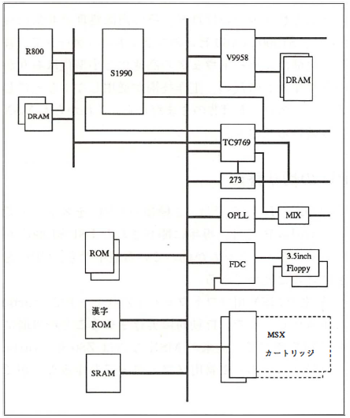

**Figure 1.1 - MSX turbo R System Configuration:** The hardware configuration of the turbo R is simplified here, omitting detailed control signal lines for clarity. The output from the V9958 is a video signal, the lines connected to the TC9769 (Z80) are for the keyboard and joystick, the output from the 273 is for the printer port, and the output from MIX is an audio signal.

The hardware configuration of the MSX turbo R (hereafter referred to as "turbo R") is shown in Figure 1.1. It includes the traditional Z80-compatible CPU and the newly developed R800 CPU. Contrary to industry rumors that the next MSX would feature Zilog's Z280 or Hitachi's HD64180 (both high-speed Z80-compatible CPUs), ASCII developed its own CPU.

The performance of this hardware rivals earlier 16-bit machines, with CPU speeds comparable to NEC's V30 (a 16-bit CPU developed by NEC). Additionally, the inclusion of the Kanji conversion dictionary in ROM saves RAM and disk space, following MSX's traditional design philosophy. This approach is even being adopted in some modern notebook PCs. In summary, the hardware of the turbo R could be described as "what everyone has been striving for."

The reason the **turbo R** has such a complex configuration is to maintain compatibility with previous hardware and software. It is truly impressive how well they accomplished this. Bravo.

Although the turbo R has fewer components, its internal processes have become incredibly sophisticated. Furthermore, the **S1990** uses a 160-pin flat package, making manual soldering impossible. While the hardware's increased speed and smaller size are advantageous, the old days of one-board microcomputers and hands-on assembly are gone. However, the MSX cartridge slot remains unchanged, ensuring that the MSX will continue to serve as an excellent learning tool for hardware beginners.

### 1.1.3 Elegant CPU Switching

In Victor's MSX2 machines (HC-90 and HC-95), two types of CPUs were switched manually via a toggle. In contrast, the turbo R employs a dedicated **S1990 LSI** to manage the system, allowing the CPU to switch seamlessly, even while programs are running.

Thanks to this hardware, legacy MSX software can run automatically in **Z80 mode**, while turbo R-exclusive software takes advantage of the faster **R800 mode**. Additionally, hybrid software for both MSX2 and turbo R can be developed to detect the hardware type and select the appropriate CPU (Z80 for MSX2, R800 for turbo R).

### 1.1.4 MSX turbo R's Packed ROM Configuration

While the turbo R appears to have many built-in ROMs, opening it reveals surprisingly few. This is due to the **S1990's MegaROM control feature**.

In an MSX2+, the ROM layout looks like the upper section of **Figure 1.2**. The main ROM and sub ROM are connected to different slots, and the Kanji ROM is connected via an I/O port. This requires separate ROMs regardless of total capacity. However, using a single 128-kilobyte ROM is cheaper, more space-efficient, and consumes less power than using four 32-kilobyte ROMs.

The turbo R integrates all components—main ROM, sub ROM, OPLL driver, DOS, first-level Kanji, and second-level Kanji—into a single 512-kilobyte ROM, as shown in the lower section of **Figure 1.2**. The **S1990's MegaROM control feature** makes the software perceive, for example, the first-level Kanji ROM as if it were connected to I/O ports **D8H** and **D9H**.

Additionally, the **64-kilobyte DOS ROM** (16 kilobytes for MSX-DOS and 48 kilobytes for MSX-DOS2) is divided into four banks within a 16-kilobyte space in slot 3-2 onnected using a switching method.

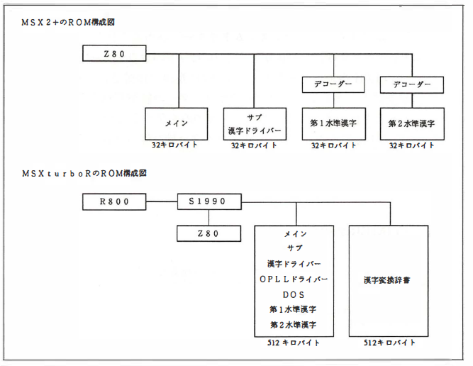

**Figure 1.2 - Changes in ROM Configuration in MSX turbo R:** The image illustrates the ROM configurations for the MSX2+ and MSX turbo R systems. In the MSX2+, the Z80 CPU connects to individual ROMs: a Main ROM (32 kilobytes), a Sub ROM with Kanji Driver (32 kilobytes), and two Decoders for First-Level Kanji and Second-Level Kanji ROMs (each 32 kilobytes). This configuration uses separate ROMs for each function. In the MSX turbo R, the configuration is streamlined using the S1990 LSI, which manages both the R800 and Z80 CPUs. All essential components, including the Main ROM, Sub ROM, Kanji Driver, OPLL Driver, DOS, First-Level Kanji, and Second-Level Kanji, are integrated into a single 512-kilobyte ROM. An additional 512-kilobyte ROM is dedicated to the Kanji Conversion Dictionary, highlighting a more efficient and compact design compared to the MSX2+.

### 1.1.5 System Timer for Adjusting Speed

To ensure that the **R800** CPU does not execute too quickly for the **V9958** (a screen display controller LSI), the **S1990**'s built-in VDP interface circuit automatically adds wait cycles to the R800 when it accesses the V9958 within an 8-microsecond interval. This prevents the V9958 from malfunctioning due to excessive CPU speed.

However, since other peripheral LSIs lack this automatic wait feature, software must manually adjust timing. Traditional software often used instructions like:

```assembly
EX (SP), HL
EX (SP), HL
```
or
```assembly
PUSH HL
POP HL
```
These instructions take time but have no side effects, allowing software to manage timing. However, as explained later, the execution times of R800 instructions are variable, making this approach ineffective. To address this, the turbo R includes a "system timer" for speed adjustments.

The system timer is a 16-bit counter that increments every 3.911 microseconds. The lower byte is connected to I/O port E6H, and the upper byte to I/O port E7H. To avoid issues when reading the counter as its value changes, it is better to use only one of the bytes (either the lower or the upper byte).

Below is an example program that waits for a duration of B register value × 3.911 microseconds. By modifying the program to use the upper byte instead of the lower byte, you can create a program that waits for B register value × 1001.2 microseconds.

#### Listing 1.1: TIMER.Z80

```assembly
COUNTLOW  EQU 0E6H  ; Lower 8 bits of the counter
COUNTHIGH EQU 0E7H  ; Upper 8 bits of the counter

; B register value × 3.911 μs wait
; Do not set B register to 0
; Interrupts must be disabled
; C, A, and F registers will be altered

WAIT:
  IN A, (COUNTLOW)      ; Get current counter value
  LD C, A               ; Store it
WAIT_LOOP:
  IN A, (COUNTLOW)      ; Get current counter value again
  SUB C                 ; Calculate elapsed time
  JR C, WAIT_LOOP       ; Loop until the specified time has passed
  RET
```
This system timer allows precise control of processing speed, ensuring compatibility with various peripherals and avoiding timing issues.

### 1.1.6 MSX turbo R I/O Ports

Since the press release materials for the **MSX turbo R** did not include an I/O map, the editorial team created **Table 1.1** based on information gathered through research and hardware analysis. The table extends the MSX2+ I/O map with additional entries for the turbo R. Entries marked with an **"R"** denote I/O ports newly added in the turbo R.

Key Features:
- The **D/A Converter** I/O port is for controlling PCM recording and playback without relying on the BIOS. Details will be introduced later.
- The **Pause Key Control** I/O port enables or disables program suspension via the pause key, preventing interruptions during disk operations that could cause data corruption.
- The **Kanji ROM Expansion** port is reserved for future Kanji ROMs, such as 24-dot Kanji ROMs or potential third-level JIS Kanji ROMs.

The **System Timer** port, explained earlier, is also included in this table, along with I/O ports for testing hardware functionality at the factory. Additionally, the **Reset Status** port distinguishes between hardware resets and restarts initiated by jumping to address 0 of the main ROM.

**Table 1.1:** MSX turbo R I/O Map

| Address Range | Purpose                 | Notes                   |
| ------------- | ----------------------- | ----------------------- |
| 00H–3FH       | Custom Hardware         | Manufacturer-defined    |
| 40H–7BH       | OPLL + B                | BIOS must be used       |
| 7CH–7DH       | RS-232C                 |                         |
| 80H–87H       | External VDP            |                         |
| 88H–BBH       | Printer                 |                         |
| 90H–93H       | VDP                     |                         |
| 98H–9BH       | PSG                     |                         |
| A0H–A2H       | D/A Converter (R)       | New in turbo R          |
| A4H–A5H       | Pause Key Control (R)   | New in turbo R          |
| A7H           | 8255                    |                         |
| A8H–ABH       | MSX-Engine              |                         |
| ACH–AFH       | SONY SRAM               | Discontinued in turbo R |
| B0H–B3H       | Clock                   |                         |
| B4H–B5H       | Light Pen               | Discontinued in turbo R |
| BBH           | VHD Interface           | Manufacturer option     |
| BCH–BFH       | MSX-Audio               | Manufacturer option     |
| C0H–C1H       | Floppy Disk Drive       |                         |
| CBH–CCH       | First-Level Kanji ROM   |                         |
| D0H–D7H       | Second-Level Kanji ROM  |                         |
| DBH–D9H       | Kanji ROM Expansion (R) | New in turbo R          |
| DAH–DBH       | Reserved (?)            | Hardware test port      |
| DCH           | System Timer (R)        | New in turbo R          |
| E3H–E5H       | Memory Mapper Control   |                         |
| E6H–E7H       | Memory Mapper I/O Ports |                         |
| F4H           | Reset Status            | BIOS must be used       |

Additional Notes:
- **BIOS Dependence**: It is critical to use the BIOS for handling peripherals like PSG, joystick, mouse, printer, keyboard, and clock. This ensures proper operation across different MSX models, as some signals differ between machines.
- **Reset Status Port**: This port differentiates between a hardware reset and a software restart by jumping to address 0 in the main ROM. Using the BIOS ensures compatibility since the logic for the reset signal may vary across machines.
- **Memory Mapper**: With DOS2 now standard in the turbo R, the memory mapper has become more important. It requires a slightly complex process involving extended BIOS functions to operate.

The table also includes some features no longer implemented in recent MSX models. While modern MSX computers focus on standard computing needs, the author laments the decline in quirky peripherals that once made the MSX ecosystem unique.

### 1.1.7 DRAM Mode to Maximize Speed

Memory has a limitation called "access time," which is the minimum time interval for reading and writing. If the CPU operates too quickly, "wait states" must be introduced to match the memory speed. Access times vary by type, with faster memory being more expensive, and generally, RAM has shorter access times than ROM.

To maximize the speed of the **R800**, programs should be stored in RAM rather than ROM. For this reason, a "DRAM mode" is implemented in the turbo R. It transfers the contents of ROMs (BIOS, BASIC, Sub-ROM, Kanji Driver, etc.) into DRAM (main RAM) for faster operation. The last 64 kilobytes of main RAM are disconnected from the memory mapper, the ROM contents are transferred, and the region is set to read-only, making the CPU perceive the ROM as if it were replaced by high-speed ROM.

DRAM mode enhances speed significantly, especially when running programs written in BASIC, as it frequently accesses the ROM containing the BIOS and BASIC interpreter. However, for machine-language programs, particularly DOS-based ones, the ROM is accessed less frequently. In such cases, utilizing the extra memory as a RAM disk might be more advantageous than using DRAM mode.

Additionally, while programs from ROM cartridges can also run faster when transferred to RAM, disk-based software is expected to become more dominant with the turbo R.

### 1.1.8 Features of the R800

- **Object compatibility with the Z80:** Software written for the Z80 will generally run on the R800, except for sections dependent on specific CPU timing.
- **Clock speed:** The CPU operates at 7.16 MHz. However, since the number of clock cycles per instruction is significantly reduced compared to the Z80, the R800 is equivalent to a 29 MHz Z80 (in a no-wait state scenario).
- **Multiplication instructions:** Supports 16-bit × 16-bit → 32-bit precision multiplication, drastically improving calculation speed.
- **Byte access to IX/IY registers:** Officially supports upper and lower 8-bit access to IX/IY registers, which was undefined in the Z80.

### 1.1.9 All About the R800

The **R800**, the CPU of the turbo R, is a high-speed CPU with software-level compatibility with the Z80. Unless the CPU speed causes issues, Z80 software can run faster on the R800 without modifications.

Enhancements over the Z80 include:

- 16-bit multiplication instructions.
- Byte-access instructions for IX/IY registers, previously considered "tricks" on the Z80.

For more details, refer to the R800 instruction table in the appendix.

While the clock speed of the Z80 was 3.58 MHz, the turbo R operates at 7.16 MHz. This doubling of clock speed alone does not account for the actual speed increase. The R800 requires fewer clock cycles per instruction, and there are no wait states for RAM access during M1 cycles. As a result, the R800 achieves an effective processing speed equivalent to a 29 MHz Z80.

**Table 1.2:** Comparison of Operating Speeds Between Z80 and R800

| Instruction  | MSX2+ Time (µs) | Turbo R Time (µs) | Speed Ratio |
| ------------ | --------------- | ----------------- | ----------- |
| LD r,s       | 1.40            | 0.14              | x10.0       |
| LD r, (HL)   | 2.23            | 0.42              | x5.3        |
| LD r, (IX+n) | 5.87            | 0.70              | x8.4        |
| PUSH qq      | 3.35            | 0.56              | x6.0        |
| LDIR (BC=0)  | 6.43            | 0.98              | x6.6        |
| ADD A,r      | 1.40            | 0.14              | x10.0       |
| IN C,r       | 1.40            | 0.14              | x10.0       |
| ADD HL,ss    | 3.35            | 0.14              | x24.0       |
| INC ss       | 1.96            | 0.14              | x14.0       |
| JP           | 3.07            | 0.42              | x7.3        |
| JR           | 3.63            | 0.42              | x8.7        |
| DJNZ (B≠0)   | 3.91            | 0.42              | x9.3        |
| CALL         | 5.03            | 0.84              | x6.0        |
| RET          | 3.07            | 0.56              | x5.5        |
| MULTU A,r    | -               | 1.96              | -           |
| MULTUW HL,rr | -               | 5.03              | -           |

The R800 significantly improves instruction execution speed. For example, data transfers (LD instructions) and additions are 10 times faster. However, these values are measured under no-wait conditions, so actual performance may vary. The conditions under which wait states occur, and how to avoid them, will be explained later.

The R800 has an 8-bit external data path but processes data internally with a 16-bit data path. This allows instructions like 16-bit additions to be completed in a single cycle. Compared to the Z80, the R800 is more similar to 16-bit CPUs like Intel's 8088 or Motorola's MC68008, which also have 8-bit external data paths.

Additionally, the "address expansion mechanism (mapper)" in the R800 appears to be designed for non-MSX uses. In the turbo R, system control is handled by the **S1990**, which integrates slot control and memory mapper functionality.

Now, let’s delve into the concept of "DRAM Page Access." 

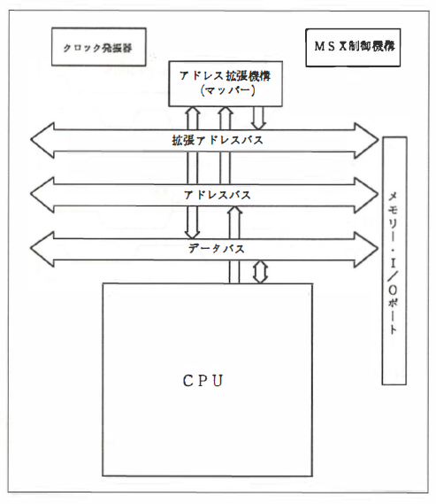

**Figure 1.3: Internal Block Diagram of R800:** illustrates the architecture of the R800 CPU and its associated components. The Clock Generator is responsible for timing signals. The Address Expansion Mechanism (Mapper) handles address extension using the Extended Address Bus, which interfaces with the main Address Bus and Data Bus for communication with memory and I/O ports. Additionally, the MSX Control Mechanism coordinates with these buses, ensuring seamless operation within the MSX system. This structure highlights the advanced design of the R800, capable of efficient data handling and memory management.

The conventional memory access method used with the **Z80** is illustrated in the lower section of **Figure 1.4**. First, the upper byte of the address (row address) is sent to the DRAM, and the **RAS (Row Address Strobe)** signal is set to **LOW**. Next, the lower byte of the address (column address) is sent to the DRAM, followed by setting the **CAS (Column Address Strobe)** signal to **LOW**. This sequence specifies the memory address.

On the other hand, the upper section of **Figure 1.4** demonstrates the **DRAM Page Access** method used by the **R800**. By keeping the upper byte of the address and the **RAS signal** fixed, only the lower byte of the address and the **CAS signal** are changed. This method allows the R800 to utilize DRAM at **twice the speed** of the conventional approach. The R800 automatically employs page access when the upper byte of the address remains unchanged and DRAM is accessed sequentially.

As for the types of DRAM suitable for continuous use with the R800, these include:
- **256 kilobit (32 kilobyte)** DRAM,
- **1 megabit (128 kilobyte)** DRAM,
- **4 megabit (512 kilobyte)** DRAM.

Even with the **turbo R**, which sets the minimum main RAM capacity at **256 kilobytes**, only **two 1-megabit DRAM chips** are required to fulfill this specification.

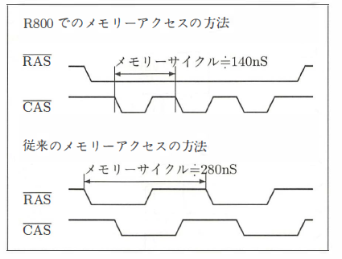

**Figure 1.4: Differences in Memory Access Methods Between Z80 and R800:** highlights the improved memory access efficiency of the R800 compared to the Z80. In the R800, memory cycles are completed in 140 nanoseconds by keeping the RAS (Row Address Strobe) signal constant while only varying the CAS (Column Address Strobe) signal, enabling faster page access. In contrast, the Z80 requires 280 nanoseconds per memory cycle as both the RAS and CAS signals change during each operation. This optimization allows the R800 to achieve double the memory access speed of the Z80.

In comparison, the first MSX, developed in 1983, required **eight 16-kilobit DRAM chips** to achieve a main RAM capacity of only **16 kilobytes**. Reflecting on this, the ability to achieve **256 kilobytes** of RAM capacity with just two DRAM chips today demonstrates the remarkable advancements in technology. While the functionality of the MSX has significantly increased, the hardware’s size and power consumption have decreased. This application of Japan’s latest semiconductor technology is evident in recent innovations like notebook PCs and the **turbo R**.

## 1.2 Utilizing MSX turbo R

### 1.2.1 Programming to Maximize R800 Speed
The R800 is indeed fast, but leveraging its full potential requires careful programming to avoid wait states. Keep in mind:
- **3 wait states** occur when accessing external slots.
- **2 wait states** occur when accessing built-in ROM.
- **1 wait state** occurs when DRAM cannot be accessed in page mode.

Ideally, programs should be placed within a **256-byte range** of internal RAM with the same upper address byte (page-accessible range), and registers should hold data. In such cases, there are no memory accesses for data, and the CPU reads the program in page mode without wait states. While it's challenging to apply this optimization to all programs, focusing on high-performance subroutines can significantly improve speed.

Page access depends on the addresses of the program, data, and stack. For example, the execution time of the `PUSH HL` instruction is:
- **4 clock cycles** if the instruction’s address and stack pointer have matching upper bytes.
- **5 clock cycles** if they do not match.

Though detailed optimization for such conditions may not always be necessary, it's important to understand that execution times vary depending on circumstances.

### 1.2.2 Precautions and Challenges When Using the R800

Unlike the Z80, which refreshed DRAM with every instruction, the R800 refreshes DRAM every **31 microseconds**, taking **280 nanoseconds** each time. Due to this refresh interval and the conditions for DRAM page access, it is difficult to precisely predict the R800’s program execution time.

To address this, you can use the **System Timer** to adjust program speed. Details on how to use the System Timer and synchronize the CPU and VDP speeds will be explained later.

A notable challenge with the R800, as with any new CPU, is the lack of development tools. In particular, the **ICE (In-Circuit Emulator)**, which is highly effective for debugging software, cannot be used with the R800. 

For developing turbo R software, the recommended approach is to:
1. Use an ICE designed for traditional MSX and Z80 systems to thoroughly debug your program.
2. Convert the verified program for turbo R, adjusting specific sections (e.g., multiplication routines) for the R800.
3. Test subroutines individually before assembling the complete program. If issues arise, manual review of the source code may be necessary.

### 1.2.3 New BIOS Features and Their Functionality
To support the new hardware capabilities of the turbo R, additional BIOS functions were introduced for:
- Switching between CPUs.
- Recording and playback with PCM.

Each BIOS function is described with its:
- **Label** (name),
- **Entry Address** (location),
- Functionality and register usage.

Symbols used for describing BIOS functions:
- **Input Registers:** Registers where values must be set before calling the BIOS.
- **Output Registers:** Registers where the BIOS returns values.
- **Clobbered Registers:** Registers overwritten with meaningless values by the BIOS, potentially destroying their previous contents.

Additionally:
- **IYH** refers to the upper byte of the **IY register**, while the lower byte is ignored.

**CHGCPU - 0150H Addres**

Switches the current CPU.

The **A register's bits 1 and 0** are used to set the following modes. Among these, the "R800 DRAM" mode refers to the process where the contents of the BIOS ROM are transferred to DRAM for use.

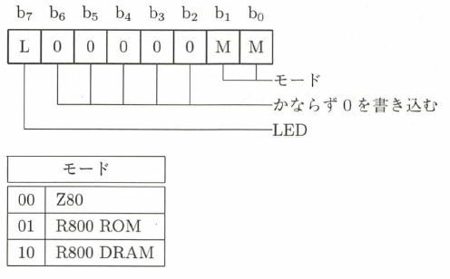

Additionally, if **bit 7** of the **A register** is set to **1**, the LED indicating which CPU is active will change. Conversely, if **bit 7** of the **A register** is set to **0**, the CPU will switch, but the LED will remain unchanged.

- **Input:** None  
- **Clobbered Registers:** **AF**

The contents of the registers prior to switching, except for **AF** and **R**, are carried over to the new CPU. After switching, interrupts are enabled. Detailed precautions regarding CPU switching will be explained later.

**GETCPU - 0153H Address**

Checks which CPU is currently active.

- **Input:** None  
- **Output:** Depending on the currently active CPU, the following values are returned in the **A register**:
  - **00**: Z80  
  - **02**: R800 DRAM  

- **Clobbered Registers:** **F**

Before calling this BIOS function, ensure that the hardware is confirmed to be a **turbo R** using methods explained later.

**PCMPLY - 0156H Address**

Plays PCM sound.

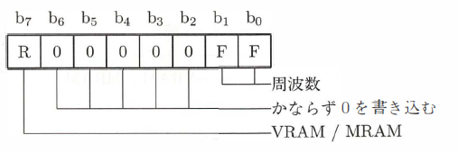

**Input:**
- **A Register**:  
  - **Bit 7**:  
    - `1`: PCM sound source data is placed in video RAM.  
    - `0`: PCM sound source data is placed in main RAM.  
    - If the data is in video RAM, the values in the **D** and **E** registers are meaningful.  
  - **Bits 1 and 0**: Used to set the sampling frequency:  
    - `00`: 15.75 kHz (only available in R800 DRAM mode).  
    - `01`: 7.875 kHz.  
    - `10`: 5.25 kHz.  
    - `11`: 3.9375 kHz.  

- **EHL**: Address of the data.  
- **DBC**: Length of the data.  

 **Output:**
- **Carry Flag**:  
  - `0`: Normal termination.  
  - `1`: Abnormal termination.  

- **A Register**: Indicates the cause of abnormal termination:  
  - `1`: Frequency specification error.  
  - `2`: Interrupted by STOP key.  

- **EHL**: Address where the playback was interrupted.  

**Clobbered Registers:** All

**PCMREC - 0159H Address**

Records PCM sound.

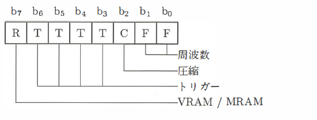

**Input:**
- **A Register**:  
  - **Bit 7, 1, and 0**: Configuration is the same as described in **PCMPLY**.  
  - **Bits 6–3**: **Trigger Level**  
    - Specifies the sound volume threshold to start recording.  
    - If the value is `0`, recording begins immediately.  
  - **Bit 2**: Compression Mode  
    - `1`: Compresses the recording data.  
    - `0`: Does not compress the data.

- **EHL**: Address of the data.  
- **DBC**: Length of the data.  

**Output:**
- **Carry Flag**:  
  - `0`: Normal termination.  
  - `1`: Abnormal termination.  

- **A Register**: Indicates the cause of abnormal termination:  
  - `1`: Frequency specification error.  
  - `2`: Interrupted by STOP key.  

- **EHL**: Address where the recording was interrupted.  

 **Clobbered Registers:** All

### 1.2.4 Modified and Removed BIOS Functions

The BIOS functions that were modified or removed in the **MSX turbo R** are listed in **Table 1.3**. Below is a brief explanation of each.

**Removed BIOS Functions**

Since the turbo R lacks a cassette tape interface, calling the BIOS functions `TAPION`, `TAPIN`, `TAPIOF`, or `TAPOOF` will set the **carry flag** and return an error. Similarly, the `STMOTR` function has been removed and returns without any action.

To add new functionality while keeping the same ROM size, the BIOS functions for **paddle** and **light pen** were removed:
- Calling `GTPDL` always sets the **A register** to `0` and returns.
- Similarly, calling `GTPAD` or `NEWPAD` with light pen values (`8–11`) in the **A register** always results in `0` being returned.

**Modified BIOS Functions**

The **ROM version ID**, located at memory address `002DH`, has been updated to `03H` for the turbo R. When developing programs for the turbo R, first check if this value is `03H` or higher:
- If the value is below `03H`, the program should either function as an MSX2 program or display an error message and terminate.
- Programs must be designed to operate if the version is `03H` or higher to ensure compatibility with future MSX versions.

Incorrect version checks in the past have led to MSX2 programs that don't run on MSX2+ systems or applications that fail when paired with MSX-JE systems. Avoid such issues by ensuring programs are compatible with versions `03H` and above.

**Table 1.3:** Changes to MSX turbo R BIOS and BASIC

| **Added BIOS Entries** | **Address** |
| ---------------------- | ----------- |
| `CHGCPU`               | `0180H`     |
| `GETCPU`               | `0183H`     |
| `PCMPLY`               | `0186H`     |
| `PCMREC`               | `0189H`     |

| **Modified BIOS Entries** | **Address** |
| ------------------------- | ----------- |
| `ROM version ID`          | `002DH`     |

| **Removed BIOS Entries** | **Address** |
| ------------------------ | ----------- |
| `GTPDL`                  | `00DEH`     |
| `TAPION`                 | `00E1H`     |
| `TAPIN`                  | `00E4H`     |
| `TAPIOF`                 | `00E7H`     |
| `TAPOON`                 | `00EAH`     |
| `TAPOUT`                 | `00EDH`     |
| `TAPOOF`                 | `00F0H`     |
| `STMOTR`                 | `00F3H`     |
| `GTPAD`                  | `00DBH`     |
| `NEWPAD`                 | `SUB01ADH`  |

| **Added BASIC Statements** |     |
| -------------------------- | --- |
| `CALL PCMREC`              |     |
| `CALL PCMPLAY`             |     |
| `CALL PAUSE`               |     |

| **Modified/Removed Statements** |         |
| ------------------------------- | ------- |
| `CLOAD`                         | Removed |
| `CSAVE`                         | Removed |
| `MOTOR`                         | Removed |

When developing programs for the turbo R:
- Ensure the **ROM version ID** is `03H` or higher. This will allow the program to operate properly on turbo R and future MSX versions.
- Avoid creating programs that rely on exact version values like `03H`, as these may fail on updated MSX systems.
- Be cautious about software compatibility with newer hardware versions to avoid issues similar to those experienced with older MSX2 programs or MSX-JE systems.

**Changes in BASIC**

The BASIC functionality in the turbo R has also seen additions, modifications, and removals. Refer to **Table 1.3** or the BASIC manual included with the machine for detailed information.

### 1.2.5 Notes on Application Development

In the **MSX turbo R**, the R800 CPU does not always operate in a no-wait state. The following wait states occur during specific memory accesses:
- **3 wait states** when accessing external slots.
- **2 wait states** when accessing internal ROM.
- **1 wait state** when internal DRAM encounters a page break.

To optimize program performance, it is essential to minimize these wait states. Below are three key points to keep in mind:

1. **Transfer Programs to RAM Before Execution**  
   Software distributed on floppy disks naturally runs from RAM, so there is no issue in such cases. However, for programs supplied via ROM cartridges in slots, transferring only the necessary parts to RAM before execution can result in significant speed improvements.

2. **Avoid Page Breaks**  
   The R800 supports DRAM page access with a dedicated path, and maximizing this functionality is crucial. Specifically, design your program so that memory access occurs within a **256-byte range** where only the lower 8 bits of the address change (e.g., `??00H` to `??FFH`).  
   - A **page break** occurs when memory access exceeds this range, causing the upper 8 bits of the address to change.  
   - Minimizing page breaks allows the R800 to utilize its DRAM page access capabilities to their fullest.

3. **Use the System Timer for Timing**  
   Unlike the MSX2+ or similar systems, it is not possible to determine exact instruction execution times during the coding stage for the turbo R. This is due to:
   - Unpredictable DRAM page breaks.
   - DRAM refresh operations performed asynchronously with instruction execution.

   To address this, avoid using software loops for timing, especially for programs intended to run on both the turbo R and MSX2+. Instead, take advantage of the turbo R's **System Timer**, which increments every **3.911 microseconds**, to manage precise timing in your programs.

By following these principles, developers can create efficient applications that fully leverage the capabilities of the MSX turbo R while minimizing performance bottlenecks.

### 1.2.6 Example Program for Switching CPUs

**Listing 1.2 (CHGCPU.Z80)** demonstrates a program that switches between different CPU modes on the **MSX turbo R**. For example:
- `CHGCPU 0`: Selects **Z80 mode**.
- `CHGCPU 1`: Selects **R800 ROM mode**.
- `CHGCPU 2`: Selects **R800 DRAM mode**.

The program fetches the first command parameter from the **default FCB area** at memory address `5DH` in the DOS work area. Based on this parameter, the **A register** is set to the corresponding value, and the BIOS function located at `180H` (`CHGCPU`) in the main ROM is called.

Additionally, to ensure compatibility, the program checks:
1. The ROM version number at memory address `2DH` is `03H` or higher, confirming that it is running on the turbo R.
2. The DOS kernel version using the system call `_DOSVER` (`6FH`) is at least version 2.

#### Listing 1.2 (CHGCPU.Z80)

This program demonstrates switching between CPU modes on the **MSX turbo R**. It supports:
- **Z80 mode**: `CHGCPU 0`
- **R800 ROM mode**: `CHGCPU 1`
- **R800 DRAM mode**: `CHGCPU 2`

The program first checks the system ROM version and DOS version to confirm compatibility. Based on the provided command parameter, the corresponding CPU mode is selected by calling the BIOS function `CHGCPU`.

```assembly
Z80
RDSLT  EQU 0000CH  ; Inter-slot read
CALSLT EQU 0001CH  ; Inter-slot call
EXPTBL EQU 0FCC1H  ; Slot # of main ROM

; Check ROM version
ld a, (EXPTBL)
ld hl, 2dh          ; Address to read
call RDSLT          ; Read ROM version
cp 3                ; Check if version >= 3
jr nc, TURBOR       ; Jump if turbo R

; If not turbo R
ld de, MSG_NOTR
ld c, 9             ; STROUT
call 5
rst 0               ; Return to DOS

TURBOR:
ld c, 6fh           ; _DOSVER
call 5
ld a, b             ; DOS kernel version
cp 2
jr c, NOTDOS2       ; Jump if version < 2
ld a, d             ; MSXDOS.SYS version
cp 2
jr c, NOTDOS2

; Get command parameter
ld a, (005ch+1)     ; Command parameter
sub '0'             ; 0: Z80, 1: R800ROM, 2: R800RAM
ret c               ; Abort if parameter < '0'
cp 3
ret nc              ; Abort if parameter >= '3'

; Set LED flag and call CHGCPU
or 80h              ; Set change-LED flag
ld ix, 180h         ; Address of CHGCPU
ld iy, (EXPTBL-1)   ; Slot of main ROM
call CALSLT         ; Inter-slot call
rst 0               ; Return to DOS

NOTDOS2:
ld de, MSG_NOTDOS2
ld c, 9             ; STROUT
call 5
rst 0               ; Return to DOS

; Error messages
MSG_NOTR:
db 'not MSX turbo R', 0dh, 0ah, '$'

MSG_NOTDOS2:
db 'not MSX-DOS 2', 0dh, 0ah, '$'
```

**System Compatibility Checks:**

Reads the ROM version from address 2DH and ensures it's 03H or higher to confirm the system is turbo R.
Verifies the DOS kernel version using _DOSVER and ensures it is version 2 or higher.

Command Parameter Handling:

Retrieves the command parameter from 005CH+1 in the DOS work area.
If the parameter is valid (0 to 2), sets the A register accordingly.
BIOS Call for CPU Switching:

Calls the CHGCPU BIOS function at address 180H in the main ROM to switch CPU modes.

**Error Handling:**

Displays appropriate error messages if the system is not turbo R or if the DOS version is incompatible.

This program ensures compatibility with both hardware and software versions, allowing safe and efficient CPU mode switching.

Listing 1.3 (GAMEBOOT.Z80) is an example program for forcing R800 mode to run MSX2 programs that are not designed to work with DOS2 or the turbo R system. 

This program:

1. Displays a message on the screen and waits for the disk to be replaced.
2. Loads the boot sector from the replaced disk and executes it.

During execution, the environment matches the typical boot process:

* Page 1: DOS ROM.
* Other Pages: RAM.
* Carry Flag: Set.

It also configures the following:

* HL register: Points to the error handling program pointer in the DOS work area (F323H).
* DE register: Points to the address of the program that switches Page 1 from RAM to DOS ROM (F368H).

#### Listing 1.3 (GAMEBOOT.Z80)

This program forces **R800 mode** to execute programs (e.g., games) on the **MSX turbo R** that are not designed to run with DOS2 or turbo R's system. It displays a prompt, waits for the disk to be replaced, and then reads and executes the boot sector from the replaced disk. The setup ensures compatibility during execution with DOS ROM in **Page 1** and RAM in the other pages.

Below is the source code:

```asm
.z80
COILLIL  EQU 01h      ; Command input
STROUT   EQU 09h      ; Output string
SETDTA   EQU 1Ah      ; Set DMA transfer area
RDABS    EQU 2Fh      ; Read absolute sector
DOS      EQU 0005h    ; Call DOS
ENASLT   EQU 0024h    ; Enable slot
NOTFIRST EQU OF340h   ; Flag for initial run
MASTER   EQU OF348h   ; Slot master

; Initialize stack pointer
ld sp, (6)

; Display prompt message
ld de, PROMPT
ld c, _STROUT
call DOS

; Wait for key press
ld c, _CONIN
call DOS

; Read boot sector to address 0C000h
ld de, 0C000h
ld c, _SETDTA
call DOS
ld de, 0            ; Logical sector 0
ld l, 0             ; Drive A:
ld h, 1             ; Read 1 sector
ld c, _RDABS
call DOS

; Enable slot for booting
ld h, 40h
ld a, (MASTER)
call ENASLT

; Set error handler pointer
ld hl, OF323h       ; Error handler location
ld de, OF368h       ; Switch Page 1 to DOS ROM
xor a
ld (NOTFIRST), a
scf                 ; Set carry flag
jp 0C01Eh           ; Jump to boot sector

PROMPT:
db 'Insert game disk in drive A:', 0Dh, 0Ah
db 'and press any key', '$'
```
## 1.3 PCM Advanced Utilization Techniques

The **PCM** feature, newly added to the turbo R, presents exciting possibilities. It's natural to want to push its capabilities to the limit. This section explores various ways to use PCM, from basic operations in BASIC to machine language programming and advanced methods involving horizontal scanline interrupts.

### 1.3.1 Basics: Using PCM in BASIC

Let’s start with a basic overview of PCM in **BASIC**.

PCM (Pulse Code Modulation) converts audio signals, such as those from a microphone, into digital data, which is then stored in memory for playback. On the turbo R, PCM data can be stored in **main RAM** or **video RAM**. The sampling rate can be selected from four options:
- **15.75 kHz**
- **7.875 kHz**
- **5.25 kHz**
- **3.9375 kHz**

The higher the sampling rate, the better the quality of the sound.

**Key Commands for PCM in BASIC**

Using PCM in BASIC requires learning two commands. Their usage is summarized below for reference. Essentially, you can perform PCM recording and playback by executing these commands. However, you must pay close attention to setting the start and end memory addresses for data storage.

**Memory Allocation**

Before recording PCM data, you must allocate memory using the `CLEAR` command. Failure to do so can lead to program crashes. For example, if you plan to use memory addresses `C000H–D000H` for PCM data, you should include the following line in your program:

```basic
CLEAR 200, &HC000
```

Set it up as described. For now, a simple sample program is provided in **Listing 1.4**. Try entering it and experimenting with it.

Of course, if you use **video RAM** for PCM data, you can store the data at any address without worrying about start or end addresses. Additionally, with video RAM, you can visually check the PCM data. For instance, if you first set the screen mode using:

```basic
SCREEN 8
```

then record PCM data, the data will appear on the screen, making it an interesting experience.

If you set the screen mode as described above and then record PCM data, the data will be displayed on the screen, which might make it more interesting.

As long as you follow the precautions mentioned, you can safely perform basic PCM recording and playback. Additionally, by changing the playback sampling rate, you can play the data back at four different speeds. 

However, the main issue arises during PCM playback: the **turbo R** becomes fully dedicated to this task. Unfortunately, this means that performing other operations while PCM is playing is not possible.

#### Listing 1.4 (PCMLBAS)

```basic
10 CLEAR 100, &H9000
20 PRINT "Recording will start now.";
30 A$ = INPUT$(1): PRINT
40 _PCMREC(&H9000, &HCFFF, 0)
50 PRINT "Playing back.";
60 A$ = INPUT$(1): PRINT
70 _PCMPLAY(&H9000, &HCFFF, 0)
80 GOTO 20
```

### 1.3.2 PCM-Related BASIC Commands

**PCM Recording to Main RAM or Video RAM**

To record PCM data into main RAM or video RAM:
```basic
CALL PCMREC(@start_address, end_address, sampling_rate[, trigger_level[, compression_switch]])
```

**PCM Recording to an Array Variable**

To record PCM data into an array variable:
```basic
CALL PCMREC(array_variable_name[, length], sampling_rate[, trigger_level[, compression_switch]])
```

**Sampling Rate Settings**

| Sampling Rate Value | Frequency    |
|----------------------|-------------|
| 0                    | 15.7500 kHz |
| 1                    | 7.8750 kHz  |
| 2                    | 5.2500 kHz  |
| 3                    | 3.9375 kHz  |

**Trigger Level**

- Sets the input level at which recording starts. 
- Value range: `0–127`.
- Recording begins when the input level exceeds this value.
- If `0` or omitted, recording starts immediately.

**Compression Switch**
- `1`: Compresses silent parts of the recording.
- `0` or omitted: Does not compress silent parts.

**PCM Playback Command**
To play back PCM data:


**Playback from Main RAM or Video RAM:**
   ```basic
   CALL PCMPLAY(@start_address, end_address, sampling_rate[, S])
   ```

**Playback from an Array Variable:**
   ```basic
   CALL PCMPLAY(array_variable_name[, length], sampling_rate)
   ```

Both **PCMREC** and **PCMPLAY** temporarily switch to high-speed mode if not already in it. After execution, the system returns to its original state. However, if **R800 ROM mode** is active and a sampling rate of **15.75 kHz** is specified, an error will occur.

During recording or playback, if the **STOP key** is pressed, program execution will be interrupted.

**PCM Data Format**
- **Values 1–255** represent normal PCM data.
- **Value 0** is special:
  - It outputs a level of **127 (0 level)** for the number of times specified by the following byte.

### 1.3.3 Using PCM to Play BEEP Sounds!

You probably know that when you interrupt a BASIC program by pressing the **CTRL + STOP** keys simultaneously, a "beep" sound is emitted. Similarly, when you display a program list using the `LIST` command and stop it with **CTRL + STOP**, you hear the same "beep." While the `SETBEEP` command in BASIC allows you to change the sound, the four available options lack impact.

So, what happens if we use **PCM** for the BEEP sound? By setting up quirky sound effects, your MSX might "speak" every now and then, which can be both noisy and fun!

To achieve this, execute the program in **Listing 1.5**. This program enables you to play the BEEP sound using PCM. Note that it is exclusively for the turbo R. Although it’s not a very long program, you'll need to enter it carefully.

**Memory Considerations**

This program resides in **main RAM Page 1** (addresses `4000H–60FFH`). After running the program, you can set the upper limit of the user area above `8000H` using the `CLEAR` command. However, be cautious not to use any memory disk commands such as `CALL MEMINI`, as they will conflict with the program.

When using the `BEEP` command in BASIC, you must replace it with:
```basic
PRINT CHR$(7)
```
Otherwise, the BEEP sound will not use PCM. Keep this in mind!

**Usage Instructions**

1. **Set PCM BEEP**
   - After execution, all BEEP sounds will use PCM. Once set, the configuration remains active until the power is turned off.
   - You can modify the `CLEAR` command's settings if necessary.

2. **Reset PCM BEEP**
   - Restores the BEEP sound to its original state. Always execute this command before switching to DOS or DOS2 using `CALL SYSTEM`.

3. **PCM Data Playback**
   - Plays the currently set PCM data. This is useful for verification.

4. **PCM Data Recording**
   - Records PCM data at **15.75 kHz**. Memory addresses `8000H–CFFFH` are used during recording.

5. **Load PCM Data**
   - Loads PCM data saved in `BSAVE` format with the extension `.PCM`.

6. **Save PCM Data**
   - Saves PCM data recorded using "PCM Data Recording" to disk.

7. **END**
   - Ends the program. Alternatively, you can press **CTRL + STOP**.

The program displays simple messages on the screen for guidance. Refer to these messages as needed.

#### Listing 1.5 (PCM2.BAS)

```basic
10 SCREEN 0: WIDTH 40: DEFINT A-Z
20 CLEAR 100, &H8000
30 DEFUSR = &HD800: DEFUSR1 = &HD806: DEFUSR2 = &HD803
40 FOR I = &H8000 TO &HD87F
50 READ A$: POKE I, VAL("&H" + A$): NEXT
100 PRINT
110 PRINT "1) PCM BEEP SET"
120 PRINT "2) PCM BEEP RESET"
130 PRINT "3) PCM DATA PLAY"
140 PRINT "4) PCM DATA RECORD"
150 PRINT "5) PCM DATA LOAD"
160 PRINT "6) PCM DATA SAVE"
170 PRINT "0) END"
180 PRINT " .... HIT 0-6 KEY ="; 
190 A$ = INPUT$(1): I = ASC(A$) - ASC("0") + 1
200 IF I > 0 AND I < 8 THEN ELSE 190
210 ON I GOTO 230, 240, 310, 340, 390, 430
220 PRINT CHR$(7);: GOTO 190
230 GOSUB 470: END
240 GOSUB 470: I = USR1(0): I = USR(0)
250 PRINT "PCM BEEP IS ENABLED."
260 PRINT "WHEN USING DOS OR DOS2, BE SURE TO RESET PCM BEEP."
270 PRINT "PCM BEEP DATA IS STORED IN PAGE 1 (4100H–60FFH)."
280 PRINT "YOU CAN SET 'CLEAR' ABOVE 8000H, BUT MEMORY DISK COMMANDS LIKE 'CALL MEMINI' CANNOT BE USED."
290 PRINT "WHEN USING THE 'BEEP' COMMAND, USE 'PRINT CHR$(7)' INSTEAD."
300 END
310 GOSUB 470: POKE &HFDA4, &HC9
320 PRINT "PCM BEEP HAS BEEN RESET."
330 GOTO 100
340 GOSUB 470
350 PRINT "STARTING PCM RECORDING. (HIT ANY KEY!)";
360 A$ = INPUT$(1): PRINT: _PCMREC(&H8000, &HCFFF, 0): I = USR(0)
370 PRINT "RECORDING FINISHED."
380 GOTO 100
390 GOSUB 470
400 PRINT "PCM DATA LOAD"
410 INPUT "FILE NAME (8 CHARACTERS) ="; A$
420 BLOAD A$ + ".PCM": I = USR(0): GOTO 100
430 GOSUB 470
440 PRINT "PCM DATA SAVE"
450 INPUT "FILE NAME (8 CHARACTERS) ="; A$
460 I = USR2(0): BSAVE A$ + ".PCM", &H8000, &HCFFF: GOTO 100
470 PRINT CHR$(I + 47): PRINT: PRINT: RETURN
480 DATA C3, 4D, D8, C3, 5F, D8, CD, 6D
490 DATA D8, 3A, 42, F3, 32, 2A, D8, 21
500 DATA 2E, D8, 11, 00, 40, 01, 00, 01
510 DATA ED, B0, CD, 76, D8, 21, 29, D8
520 DATA 11, A4, FD, 01, 05, 00, ED, B0
530 DATA C9, F7, 00, 00, 40, C9, FE, 07
540 DATA C0, 01, 00, 20, 21, 00, 41, 3E
550 DATA 03, D3, A5, F3, DB, A4, D6, 01
560 DATA 38, FA, 7E, D3, A4, 23, 0B, 79
570 DATA B0, 20, F1, FB, C9, CD, 6D, D8
580 DATA 21, 00, B0, 11, 00, 41, 01, 00
```

### 1.3.4 Advanced Techniques: Using PCM in Assembly Language

When using PCM in assembly language, the quickest method is to leverage the **BIOS**. The settings for sampling rate and trigger level are almost identical to those in BASIC, so there shouldn’t be any issues.

However, since this is an advanced section, we’ll introduce two programs that allow PCM recording and playback without using the BIOS.

**Limitations of BIOS Sampling Rates**

When using the BIOS, only four sampling rates are available:
- **15.75 kHz**
- **7.875 kHz**
- **5.25 kHz**
- **3.9375 kHz**

This limitation is because the BIOS uses a counter that updates values every **63.5 microseconds**, restricting the available sampling rates. The programs introduced here bypass this limitation by using the **system timer**, which updates values every **3.911 microseconds**, to manage PCM recording and playback.

**How to Use the Recording Program**
1. **HL Register**: Set the starting memory address for PCM data storage.
2. **BC Register**: Set the size of the data to be recorded.
3. **E Register**: Set the number of system timer counts for delay. For example, a value of **16** corresponds to a sampling rate of approximately **15.75 kHz**.

**How to Use the Playback Program**
1. **HL Register**: Set the starting address of the PCM data to be played back.
2. **BC Register**: Set the size of the PCM data.
3. **E Register**: Set the number of timer counts for delay.

**Special Instruction for R800**
Within the recording program, you’ll notice the command:
```assembly
DB 0EDH, 70H
```
This corresponds to the R800-specific instruction:
```assembly
IN (HL), (C)
```
This reads a value from the port specified in the **C register** and updates only the flags. It is unique to the R800 processor.

**Experimentation and Customization**
The principle of the program aside, simply trying it out can be fun. By changing the value in the **E register**, you can explore various sound effects and enjoy experimenting with PCM playback.

#### Listing 1.6 (PCMREC.MAC)

```assembly
PMDAC  EQU 0A4H
PMCNT  EQU 0A4H
PMCNTL EQU 0A5H
PMSTAT EQU 0A5H
SYSTML EQU 0E6H ; System timer port

REC:
    LD A, 00001100B
    OUT (PMCNTL), A ; A/D MODE
    DI
    XOR A
    OUT (SYSTML), A ; Reset timer

REC1:
    IN A, (SYSTML)
    CP E
    JR C, REC1 ; Wait
    XOR A
    OUT (SYSTML), A ; Reset timer
    PUSH BC
    LD A, 00011100B
    OUT (PMCNTL), A ; DATA HOLD
    LD A, 80H
    LD C, PMSTAT
    OUT (PMDAC), A ; BIT CONVERT

    DEFB 0EDH, 70H ; IN (HL), (C)
    JP M, RECADO
    AND 01111111B

RECADO:
    OR 01000000B
    OUT (PMDAC), A
    DEFB 0EDH, 70H
    JP M, RECAD1
    AND 10111111B

RECAD1:
    OR 00100000B
    OUT (PMDAC), A
    DEFB 0EDH, 70H
    JP M, RECAD2
    AND 11011111B

RECAD2:
    OR 00010000B
    OUT (PMDAC), A
    DEFB 0EDH, 70H
    JP M, RECAD3
    AND 11101111B

RECAD3:
    OR 00001000B
    OUT (PMDAC), A
    DEFB 0EDH, 70H
    JP M, RECAD4
    AND 11110111B

RECAD4:
    OR 00000100B
    OUT (PMDAC), A
    DEFB 0EDH, 70H
    JP M, RECAD5
    AND 11111011B

RECAD5:
    OR 00000010B
    OUT (PMDAC), A
    DEFB 0EDH, 70H
    JP M, RECAD6
    AND 11111101B

RECAD6:
    OR 00000001B
    OUT (PMDAC), A
    DEFB 0EDH, 70H
    JP M, RECAD7
    AND 11111110B

RECAD7:
    OR 00000000B
    LD (HL), A
    LD A, 00001100B
    OUT (PMCNTL), A
    POP BC
    INC HL
    DEC BC
    LD A, C
    OR B
    JR NZ, REC1
    LD A, 00000011B ; End of data?
    OUT (PMCNTL), A ; D/A MODE
    EI
    RET
END
```

#### Listing 1.7 (PCMPLAY.MAC)

```assembly
PMDAC  EQU 0A4H
PMCNT  EQU 0A4H
PMCNTL EQU 0A5H
PMSTAT EQU 0A5H
SYSTML EQU 0E6H ; System timer port

PLAY:
    LD A, 00000011B
    OUT (PMCNTL), A ; D/A MODE
    DI
    XOR A
    OUT (SYSTML), A ; Reset timer

PLAY1:
    IN A, (SYSTML)
    CP E
    JR C, PLAY1 ; Wait
    XOR A
    OUT (SYSTML), A ; Reset timer
    LD A, (HL)
    OUT (PMDAC), A ; Play 1 byte
    INC HL
    DEC BC
    LD A, C
    OR B ; End of data?
    JR NZ, PLAY1 ; Next data
    EI
    RET
END
```

**Table 1.4: PCM I/O Ports**

| Address | Mode  | Bit 7      | Bit 6      | Bit 5      | Bit 4      | Bit 3      | Bit 2      | Bit 1      | Bit 0      |
|---------|-------|------------|------------|------------|------------|------------|------------|------------|------------|
| 0A5H    | Write |            |            |            |            |            |            |            |            |
| 0A5H    | Read  | **COMP**   |            |            |            |            |            |            |            |
| 0A4H    | Write | **DA7**    | **DA6**    | **DA5**    | **DA4**    | **DA3**    | **DA2**    | **DA1**    | **DA0**    |
| 0A4H    | Read  |            |            |            |            |            |            |            |            |

**Description of Flags and Functions**

- **ADDA (BUFF)**: Buffer Mode  
  Specifies the output mode of the D/A converter.
  - **0**: Double buffer (D/A mode; reset default).
  - **1**: Single buffer (A/D mode).

- **MUTE**: Muting Control  
  Turns the system audio output on or off.
  - **0**: Audio output off (default at reset).
  - **1**: Audio output on.

- **FILT**: Filter Selection for Sample-Hold Circuit Input  
  Determines whether the sample-hold circuit input is from the filter's output signal or a reference signal during A/D mode.
  - **0**: Reference signal (reset default).
  - **1**: Filter output signal.

- **SEL**: Low-Pass Filter Input Signal Selection  
  Selects the input signal for the low-pass filter:
  - **0**: D/A converter output signal.
  - **1**: Microphone amplifier output signal.

**Additional Notes**

- **SMPL (Sample-Hold Signal)**:  
  Determines whether the input signal is sampled or held.
  - **0**: Sample (reset default).
  - **1**: Hold.

- **COMP (Comparator Output Signal)**:  
  Compares the sample-hold output signal with the D/A converter output signal.
  - **0**: D/A output > sample-hold output.
  - **1**: D/A output < sample-hold output.

- **DA7–DA0 (D/A Output Data)**:  
  PCM data for playback is written here. By outputting prepared data, PCM sounds can be played.  
  - Data format: Absolute binary, where **127** corresponds to level 0.

- **CTI, CTO (Counter Data)**:  
  Incremented every **63.5 microseconds**. During D/A mode, this increments in sync, and the data written to address **0A4H** is repeatedly output. Writing data to **0A4H** also clears the counter.

# 2. Slots

This chapter is a re-edited version of articles from **MSX Magazine**:  
- **February 1989** and **March 1989** issues: *MSX2+ Technical Exploration Team*.  
- **November 1990** issue: *Technical Analysis*.  

## 2.1 What is a Slot?

The slot in which cartridges are inserted on an MSX is known as the "cartridge slot." However, slots also serve a more critical role: **managing the MSX's memory**. This chapter delves into one of the most significant and complex features of MSX: the **slot system**.

### 2.1.1 How are the CPU and Memory Connected?

Two of the most vital components of any computer are the **CPU** and the **memory**:
- **CPU (Central Processing Unit):** The brain of the computer, responsible for managing operations and performing calculations.
- **Memory:** Functions like a notepad, storing the data the CPU processes.

The information a computer handles is represented in **binary (base 2)**, using combinations of `0` and `1`. A single binary digit is called a **bit**, and a group of eight bits is called a **byte**. In programming, binary numbers are often cumbersome to work with directly, so **hexadecimal (base 16)** is used. Hexadecimal condenses four binary digits into a single character, ranging from `0-9` and `A-F`.

In the computing world, it's important not to confuse the meaning of "kilo (K)":  
- Unlike in general usage (where `K = 1000`), in computing, **K = 1024**.  
- For example, a **64 KB memory** contains `64 × 1024 = 65,536 bytes`, which equals `65,536 × 8 = 524,288 bits`.

Most microcomputers assign a unique **address** to each byte of memory for management purposes. This address is commonly referred to as a **memory address**. For instance, in machine language programming, you might encounter statements like, "The starting address is `8000H`."

### 2.1.2 Inside the 8-bit Z80 CPU

The **CPU** and **memory** are connected via two pathways, as shown in **Figure 2.1**:
1. **Address Bus:**  
   This one-way pathway sends signals from the CPU to memory, specifying which address (memory location) is being accessed.
2. **Data Bus:**  
   This two-way pathway transmits data between the CPU and memory.

The **address bus** is unidirectional, while the **data bus** is bidirectional. This distinction is essential to understanding how data flows within the system.

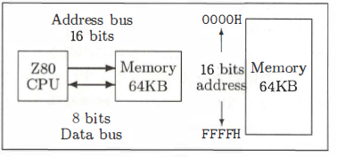

**Figure 2.1: Address and Data Buses in the Z80 CPU**

The **Z80 CPU** used in pre-turbo R MSX systems has an **8-bit data bus** (physically eight wires) and a **16-bit address bus**. This configuration allows the CPU to read and write **64 KB of memory** one byte at a time. Such CPUs are referred to as **8-bit CPUs**, making the MSX an 8-bit computer.

To elaborate on the address bus, it can specify memory addresses ranging from:
- **Binary:** `0000000000000000B` to `1111111111111111B` (B denotes binary notation).
- **Decimal:** `0` to `65,535`.
- **Hexadecimal:** `0000H` to `FFFFH` (H denotes hexadecimal notation).

Each address holds **8 bits (1 byte)** of data, representing values between `0` and `255` in decimal. This byte-level memory can be expressed as **64 KB**, allowing an 8-bit computer to connect to 64 KB of memory.

While the MSX is classified as an 8-bit computer, **16-bit computers** (with 16-bit CPUs) have become increasingly common. These systems have a **16-bit data bus**, enabling them to transfer twice as much information as an 8-bit system in one operation. They also feature more extensive address buses, allowing larger memory connections. However, these advantages come at the cost of increased complexity and higher prices. High-end computers, such as mainframes, often feature **32-bit** or even **64-bit data and address buses**.

The **MSX turbo R** includes a **16-bit CPU (R800)**, but its data bus remains **8-bit** to maintain compatibility with existing cartridges.

### 2.1.3 Types of Memory

Memory comes in various types, classified based on function and usage:

- **ROM (Read-Only Memory):**
   - Content cannot be modified but is retained even when the power is off.
   - Examples:
     - Built-in software like **BASIC**.
     - Cartridge-based software.
     - The **Kanji ROM** in MSX2+ for storing Japanese character shapes.

- **RAM (Random Access Memory):**
   - Content can be freely modified but is lost when the power is off.
   - Usage:
     - Temporary storage for calculation results in programs.
     - Loading and running programs from floppy disks.
     - Example: Entering short programs to play games, which are stored in RAM.

- **SRAM (Static RAM):**
   - A low-power RAM that retains its content with battery backup.
   - Found in:
     - Laptops and portable word processors.
     - MSX or Famicom game cartridges with battery backup.

- **Main Memory vs. Video RAM:**
   - **Main Memory (Main RAM):**  
     Directly connected to the CPU, including:
     - Built-in ROM (excluding Kanji ROM).
     - 64 KB of main RAM in MSX systems.

   - **Video RAM (VRAM):**  
     Dedicated to storing graphics and text displayed on the screen.  
     In MSX, the **VRAM** is connected to the CPU via the **VDP (Video Display Processor)**.

These foundational concepts apply not only to MSX but to computers in general. You can refer to introductory books included with MSX BASIC for more detailed explanations.

### 2.1.4 What Are MSX Slots?

As mentioned earlier, the **main memory** that an 8-bit CPU can connect to is limited to **64 KB**. However, this limitation only applied to early 8-bit computers. Modern systems employ various methods to extend memory beyond 64 KB.

In the MSX, this is achieved through a technique called **slot switching**. As shown in **Figure 2.2**, four sets of 64 KB memory can be prepared, allowing the system to switch between them and effectively handle up to **256 KB of memory**. These memory segments are referred to as **primary slots** and are also allocated to cartridge slots and other system components.

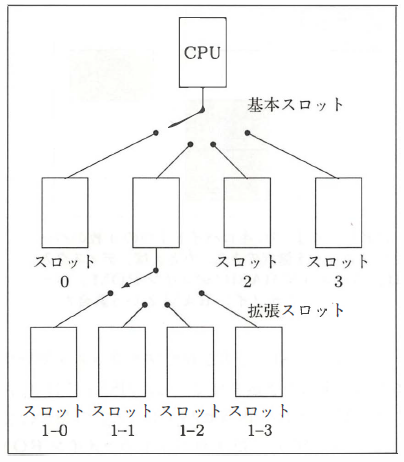

**Figure 2.2: Slot Switching in MSX**

Furthermore, instead of a single primary slot, it is possible to switch between four sets of **"expanded slots."** This setup allows for a total of 16 sets of 64 KB memory, enabling up to **1 MB (1024 KB)** of memory to be connected. However, further expansion beyond this limit is not possible.

While slot switching allows handling more than 64 KB of memory, switching the entire memory at once can be inconvenient. To address this, MSX systems divide memory into units called **"pages"** for more granular control.

**Memory Page Division**

The memory is divided into the following 16 KB pages:
- **Page 0:** Addresses `0000H–3FFFH`
- **Page 1:** Addresses `4000H–7FFFH`
- **Page 2:** Addresses `8000H–BFFFH`
- **Page 3:** Addresses `C000H–FFFFH`

Each 16 KB block (page) can independently select a different slot.

For example, during disk I/O operations in BASIC, the memory pages are allocated as follows (refer to **Figure 2.3**):
- **Page 0:** Main ROM for the BASIC interpreter.
- **Page 1:** Disk interface ROM.
- **Pages 2 and 3:** Main RAM.

**The BASIC Interpreter in MSX**

The **BASIC interpreter** is a program embedded in the MSX system ROM that processes programs written in BASIC. In the original MSX1, the BASIC interpreter was contained within a **32 KB ROM**. However, in MSX2, the size increased to **48 KB**. To accommodate this, the ROM in MSX2 is divided into two parts:
- A **32 KB Main ROM**, which retains compatibility with MSX1.
- A **16 KB Sub-ROM**, which includes features specific to MSX2.

Additionally, MSX models with built-in disk drives or external disk interface cartridges include a **16 KB ROM**. This ROM contains the **DISK BASIC** program, which handles disk-related commands. As a result, during disk I/O operations, the memory configuration switches as shown in **Figure 2.3**, with:
- Page 0 assigned to the main ROM for the BASIC interpreter.
- Page 1 assigned to the disk interface ROM.
- Pages 2 and 3 assigned to main RAM.

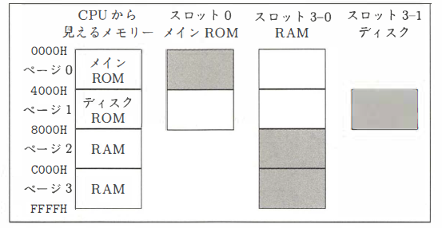

**Figure 2.3: Memory Page Allocation in Disk I/O Operations**

### 2.1.5 The Secret of MSX Expansion: The Slot System

MSX slots are not only used to expand memory but also to enhance the functionality of the system. For example:
- Slots allow connecting game cartridges or modem cartridges.
- When a disk interface cartridge is connected, its **16 KB ROM** is mapped to the appropriate slot. During disk operations, memory automatically switches to access the disk interface ROM, ensuring compatibility regardless of whether the disk interface is built-in or connected as a cartridge.

**Slot-Based BASIC Extensions**

Connecting a disk interface enables the **CALL FORMAT** command. Similarly, attaching a communication cartridge adds the **CALL TELCOM** command, both as extensions to BASIC. These commands are processed by the ROM in the respective cartridges.

In contrast to many other computers that require loading drivers from a disk to use peripherals, MSX automatically expands BASIC commands when an interface cartridge is connected. This seamless expansion of functionality is a significant advantage of MSX over other systems.

Examples of software provided as cartridges include:
- **Japanese MSX-DOS2**: An upgraded MSX-DOS with Japanese support.
- **HAL NOTE**: An integrated software suite.
- **MSX-View**: A graphical user interface (GUI) exclusive to the MSX turbo R.

These ROM cartridges demonstrate how MSX’s slot system enables straightforward functional expansion, making it a unique strength compared to other computers.

**Challenges of Slot Programming**
Although slots are a powerful feature, developing software that leverages them effectively can be complex. Even for programmers proficient in Z80 assembly language, fully understanding the slot system might take years.

### 2.1.6 MSX2+ Slot System Improvements

As discussed earlier, the slot system is a defining feature of MSX, providing extensive expandability. However, it also presents compatibility challenges:
- Slot configurations vary across MSX models, causing software compatibility issues.
- For example, some software might not work on machines where slots 1 and 3 are assigned to cartridge slots. Additionally, if RAM is located in an expanded slot like slot 3, certain functionalities, such as accessing the sub-ROM from DOS, might not work.

Although careful programming and testing across all MSX machines can mitigate these issues, accommodating every possible slot configuration can make programs longer and slower. The slot system thus remains a double-edged sword.

With MSX2+, standards were introduced to address slot configuration inconsistencies. As shown in **Figures 2.4** and **2.5**, MSX2+ machines follow a more structured slot layout. Depending on the number of built-in software components, two main configurations are possible:
1. Expanding only **slot 3**.
2. Expanding both **slot 0** and **slot 3**.

**Example: Expanding Slot 3 Only**

In this configuration:
- **Slot 0 (primary slot)** contains the main ROM for BASIC.
- **Slots 1 and 2** are allocated as external cartridge slots.
- **Slot 3** is expanded to accommodate additional memory or features.

In the expanded slot configuration of **slot 3**, one of the expanded slots contains **64 KB of RAM (Main RAM)**. This RAM is distributed across pages **0–3** within the same slot. Similarly, the **48 KB ROM** consisting of the **Sub-ROM**, **Kanji Driver**, and **Single Kanji Conversion Dictionary** is placed in another expanded slot within slot 3. 

In **Figure 2.4**, the RAM is located in **slot 3-0** (the first expanded slot of primary slot 3), and the ROM is located in **slot 3-1**. However, the exact configuration may vary depending on the machine model.

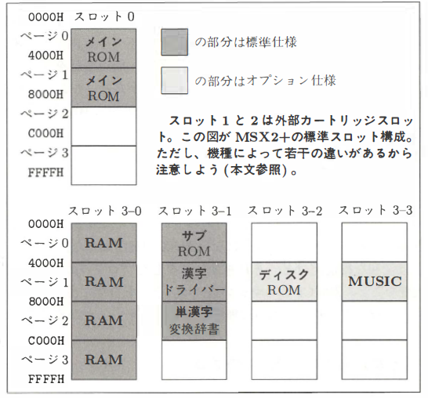

**Figure 2.4: Slot Configuration with Slot 3 Expansion Only**

In **Figure 2.5**, both **slot 0** and **slot 3** are expanded. The **Main ROM** is located in **slot 0-0** (the first expanded slot of primary slot 0). The configuration of slot 3 remains nearly identical to the example in **Figure 2.4**. Note that if the machine includes a built-in disk interface, the ROM for the disk interface is always placed in an expanded slot of **slot 3**, not in slot 0.

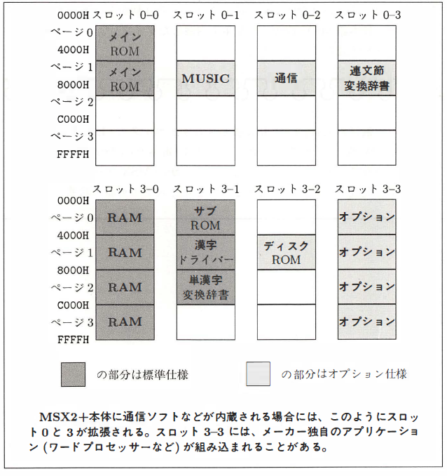

**Figure 2.5: Slot Configuration with Slot 0 and Slot 3 Expansion**

**Optional Components and External Connections**

The shaded areas in **Figures 2.4** and **2.5** represent optional components, such as:
- **Disk Interface**
- **MSX-MUSIC (FM Sound)**
- **Communication ROM**
- **Multi-Segment Conversion Dictionary ROM**

These components are part of the optional specifications for MSX2+. As such, they may not be built into the main unit and can instead be connected externally via cartridges.

**Theoretical Combinations**

For an MSX2+ machine with the same built-in software as in **Figure 2.5**, there are theoretically **36 possible configurations** of the slot system.

### 2.1.7 Expanding Slots

The **MSX machines** typically include one or two external cartridge slots (commonly used for game cartridges), which are basic slots. By connecting a **slot expander**, these can be extended into four expanded slots. For example, connecting slot expanders to both of the machine's two slots results in a total of **eight slots**.

However, note that some cartridges may not function in expanded slots. For instance, the **Japanese MSX-DOS2** (types with built-in RAM) is one such example. Verify compatibility with the software you plan to use before expanding.

The slot expander product **"MSX Expansion Slot Box EX-4"** is available at a price of **¥29,800 (tax included)** from **Japan Electronics (Phone: 03-3486-4181)**. While other manufacturers also released slot expanders, most are now unavailable.

## 2.2 Challenging Slot Switching

The **concept of slots** is integral to understanding MSX machines. This section explains how to control slots programmatically and highlights changes in the specifications for **MSX2+**.

### 2.2.1 How to Switch Slots

On MSX, the **CPU (Z80)** uses "I/O ports" to communicate with external devices such as VDPs or FM sound chips. These I/O ports act like phone lines between the CPU and peripherals, with **256 ports** identified by addresses ranging from **0 to 255** (hexadecimal **00H to FFH**).

To manipulate these ports in BASIC:
- Use the `INP` function to read a **byte** from an I/O port.
- Use the `OUT` command to write a **byte** to an I/O port.

In assembly language:
- Use the `IN` and `OUT` instructions for similar operations.

The **basic slot** is switched by writing a value to I/O port **A8H**. Conversely, reading from this port reveals the current slot configuration:
- Bits **7 and 6** correspond to **page 3**.
- Bits **5 and 4** correspond to **page 2**.
- Bits **3 and 2** correspond to **page 1**.
- Bits **1 and 0** correspond to **page 0**.

For example:
- Writing the value **11110000B** (binary) switches **pages 3 and 2** to slot 3, and **pages 1 and 0** to slot 0.

Expanded slots are controlled using memory address **FFFFH**, but this process is more complex and not covered here.

Switching slots directly through programs can lead to compatibility issues and may not work across different machine models. Instead, the **BIOS (Basic Input Output System)** is used to manage slot switching. BIOS is a collection of machine-language subroutines for hardware control, offering various features beyond slot switching.

### 2.2.2 Specifying Slot Numbers

When using BIOS to switch slots, both the **basic slot number** and **expanded slot number** must be specified. However, using two CPU registers for this purpose is inefficient. To address this, an 8-bit (1-byte) scheme is employed to combine basic and expanded slot information.

For example:
- To specify **basic slot 0**, use the value **00000000B** (hexadecimal **00H**).
- To specify **basic slot 3, expanded slot 1**, use the value **10000111B** (hexadecimal **87H**).

This efficient approach consolidates slot specification into a single byte, as illustrated in **Figure 2.6**.

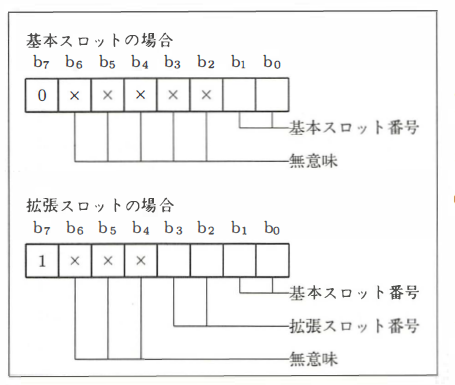

**Figure 2.6: Slot Number Specification**

### 2.2.3 BIOS Functions for Slot Operations

To use BIOS for slot operations, it's important to understand the symbols used to represent the functions:
- **Set**: Registers that must be set with values before calling the BIOS.
- **Return**: Registers where the BIOS will return values.
- **Overwrite**: Registers overwritten with meaningless values (original content will be lost).
- **IYH**: Refers to the high byte of the **IY register**; the low byte's content is ignored.

The addresses listed are the **entry points** for calling each BIOS function.

**RDSLT (Address: `000CH`)**

Reads the content of a specified address in the slot provided by the **A register**.
- **Set**: A (Slot number), HL (Address)
- **Return**: Register A contains the read value.

**WRSLT (Address: `0014H`)**

Writes the content of the **E register** to a specified address in the slot provided by the **A register**.
- **Set**: A (Slot number), HL (Address), E (Value to write)
- **Return**: Registers AF, BC, D are overwritten.
- **Note**: Interrupts are disabled during execution.

**CALSLT (Address: `001CH`)**

Calls a subroutine in another slot.
- **Set**: IX (Address to call), IYH (Slot number)
- **Return**: Based on the called subroutine.
- **Overwrite**: Registers IX, IY, shadow registers are overwritten.
- **Description**: The current slot state is saved to the stack, and the target subroutine is called. The values of registers AF, BC, DE, HL are passed to the subroutine and are restored after execution. The stack size depends on the slot configuration.

**ENASLT (Address: `0024H`)**

Switches slots.
- **Set**: A (Slot number), H (Page: upper 2 bits)
- **Overwrite**: Registers AF, BC, DE, HL are overwritten.
- **Note**: To switch page 2, set H to a value between `80H` and `BFH`. Interrupts are disabled during execution.

**CALLF (Address: `0030H`)**

Calls a subroutine in another slot with an `RST` instruction.
- **Set**: RST `30H` instruction followed by the slot number and address in the program.
- **Return**: Based on the called subroutine.
- **Overwrite**: Registers IX, shadow registers are overwritten.
- **Description**: Similar to CALSLT but used for specific purposes like debugging hooks.

**EXTROM (Address: `01C0H`)**

Calls a subroutine in the **sub-ROM**.
- **Set**: IX (Address to call)
- **Return**: Based on the called subroutine.
- **Overwrite**: Registers IX, IY, shadow registers are overwritten.
- **Description**: Automatically selects the sub-ROM slot and functions like CALSLT otherwise.

**Limitations of BIOS Functions**

The BIOS functions described have the following restrictions:
1. Cannot be used with **page 3**.
2. For **page 0**, they work only when calling the main ROM from DOS.
3. They work without issues for **pages 2 and 3**, depending on the slot configuration.

**Note**: Ensure compatibility across different MSX models. Some functions may behave differently based on the slot configuration and the type of disk interface. Avoid creating programs that only work on a single MSX machine.

### 2.2.4 Understanding Slot Configurations

As previously mentioned, the **slot configuration** varies between MSX machines. With optional components like disk interfaces, each machine may have unique slot setups. To identify the slot configuration and check for optional hardware, examine the **system work area** (memory addresses `F380H` to `FFFEH`), which stores important BIOS-related information. If a disk interface is connected, the **disk work area** is located nearby.

For example:
- **Main RAM Slot**: Found using entries like `RAMADO` in the disk work area. Without a disk, this information may be unavailable.

The program in **Listing 2.1** displays the slot configuration by reading from the system work area. Run this program on your MSX machine and observe its results.

Refer to **Table 2.1** for system work area entries related to slots. For additional details, consult the **"MSX 2 Technical Handbook"** or similar resources.

**Table 2.1: System Work Area for Slot Information**

| **Name**        | **Address**    | **Description**                                                                                     |
|------------------|----------------|-----------------------------------------------------------------------------------------------------|
| **RAMAD**       | `FFF344H`      | Slot number of Page 0 RAM.                                                                          |
| **RAMEX**       | `FFF348H`      | Slot number of expanded RAM in Page 3.                                                             |
| **EXPTBL**      | `FFFCCCH`      | Indicates whether the RAM in Page 0 is expanded or not. For example, `80H` means expanded.          |
| **DISKFLG**     | `FFA7H`        | Indicates whether a disk drive is connected. `C9H` means no disk, otherwise a disk is present.      |
| **VIDEORAM**    | `FAFCH`        | Indicates the capacity of the video RAM: `00` = 16KB, `01` = 64KB, `10` = 128KB.                   |
| **BIOSFUNC**    | `FFCAH`        | Indicates the availability of extended BIOS functions.                                              |
| **BIOSSLOT**    | `FFCBH`        | Slot number of the program using extended BIOS functionality.                                       |
| **EXPORTFLAG**  | `2BH`, `2CH`   | Stores regional information for export models, such as keyboard and currency types.                |

**Notes:**

- **RAMAD**: Points to the location in the system work area where the slot number of Page 0 RAM is stored.
- **RAMEX**: Refers to the slot for expanded RAM in Page 3, if available.
- **EXPTBL**: Used to check if Page 0 RAM has been expanded. `80H` means expanded, and `0` indicates no expansion.
- **DISKFLG**: Determines whether a disk is present. If the value is `C9H`, no disk is connected. Any other value indicates a disk is connected.
- **VIDEORAM**: Specifies the video RAM size. The bits indicate capacity: `00` = 16KB, `01` = 64KB, `10` = 128KB.
- **BIOSFUNC**: Shows if extended BIOS functions like modem or FM sound are available. If `FB20H` bit 0 is set to `1` and `FFCAH` is not `C9H`, extended BIOS functions are present.
- **BIOSSLOT**: Contains the slot number of the program using the extended BIOS.
- **EXPORTFLAG**: Relevant for export models; the bits specify regional settings such as keyboard layout or currency.


**Important**: Avoid modifying the system work area unless explicitly instructed. Programs that use the system work area for memory can cause compatibility issues.

### 2.2.5 Exploring the System Work Area

To create software that adapts to different hardware setups, use the system work area to identify hardware types and configurations:
- Check for a **disk interface** by reading address `FFA7H`. Value `C9H` means no disk, while other values indicate a disk presence.
- Identify the **MSX type** by reading address `2DH` in the main ROM:
  - `0`: MSX1
  - `1`: MSX2
  - `2`: MSX2+
  - `3`: Turbo R

To determine **video RAM capacity**, read address `FAFCH`. Bits 1 and 2 indicate:
- `00`: 16 KB
- `01`: 64 KB
- `10`: 128 KB

For **extended BIOS features** (e.g., modems, FM sound), check bit 0 at `FB20H`. If set, additional checks are needed to determine the specific functionality.

**Tip**: Test slot configurations on multiple machines to ensure compatibility and reliability.

#### Listing 2.1 (WHO_AM_I.BAS)
```basic
10 ' Identify MSX version
100 VE = PEEK(&H002D) : ' Read MSX version from main ROM
110 IF VE = 0 THEN PRINT "I am MSX1"
115 IF VE = 1 THEN PRINT "I am MSX2"
160 IF VE = 2 THEN PRINT "I am MSX2+"
165 IF VE > 3 THEN PRINT "Who MSX turbo R"

180 ' Identify VRAM size
VR = (PEEK(&HFAFC) AND 6) / 2 : ' Read VRAM capacity
190 IF VR = 0 THEN PRINT "VRAM 16KB"
200 IF VR = 1 THEN PRINT "VRAM 64KB"
210 IF VR > 1 THEN PRINT "VRAM 128KB"

220 ' Identify Main RAM size
MR = PEEK(&HFC49) : ' Read size of main RAM
230 IF MR >= &HE0 THEN PRINT "RAM 8KB"
240 IF MR >= &HCO AND MR < &HE0 THEN PRINT "RAM 16KB"
250 IF MR >= 32 THEN PRINT "RAM 32KB"

260 ' Check for expanded slots
FOR S = 0 TO 3
270 PRIMARY_SLOT = PEEK(&HFFFCC0 + S) : ' Read primary slot for page S
280 PRINT "Primary slot"; S; "is"; PRIMARY_SLOT
290 NEXT S

300 ' Check for sub-ROM location
SUB_ROM_SLOT = PEEK(&HFFA7) : ' Read sub-ROM location
310 IF SUB_ROM_SLOT <> &HC9 THEN PRINT "Sub-ROM is in slot"; SUB_ROM_SLOT

320 ' Check for disk controller slot
DISK_SLOT = PEEK(&HFFF348) : ' Read disk controller slot
330 IF DISK_SLOT <> 255 THEN PRINT "Disk controller is in slot"; DISK_SLOT

340 ' Check for BIOS extensions
EXT_BIOS_SLOT = PEEK(&HFFFCC4) : ' Read BIOS extension slot
350 IF (PEEK(&HFB20) AND 1) <> 0 AND PEEK(&HFFCA) <> &HC9 THEN PRINT "Extended BIOS is in slot"; EXT_BIOS_SLOT

360 ' Output all results
PRINT "MSX Configuration Summary:"
PRINT "MSX Version:"; VE
PRINT "VRAM Size:"; VR; "KB"
PRINT "Main RAM Size:"; MR; "KB"
PRINT "Primary Slot Information:"
FOR S = 0 TO 3
    PRINT "Page"; S; "Primary Slot:"; PRIMARY_SLOT
NEXT S
PRINT "Sub-ROM Slot:"; SUB_ROM_SLOT
PRINT "Disk Controller Slot:"; DISK_SLOT
PRINT "Extended BIOS Slot:"; EXT_BIOS_SLOT
370 END
``` 

### 2.2.6 MSX2+ Hardware Specifications

The **MSX2+** introduced several hardware improvements, including updates and additions to I/O ports. Table **2.2** summarizes the newly defined or added I/O ports for MSX2+.

**Table 2.2: I/O Ports for MSX2+**

| Address | Purpose                         |
|---------|---------------------------------|
| **7CH** | Built-in FM Sound Generator    |
| **7DH** | Built-in FM Sound Generator    |
| **DAH** | Initial Configuration Control  |
| **DFFH** | Reserved                      |
| **4B5H** | Kanji Character Display Control |

While these ports were newly defined or added, it is recommended to use **BIOS** instead of directly accessing the I/O ports in your programs.

**Built-In FM Sound Generator**

The **7CH** and **7DH** ports are used to control the built-in **FM Sound Generator**. If an FM sound generator is provided via an external cartridge (e.g., a future release), it would use the same I/O ports as Panasonic’s **FM-PAC**.

To check whether an FM sound generator is built into the main unit:
1. Read from memory addresses **4018H–401FH** for each slot.
2. If the content matches the string `"APRLOPLL"`, the FM sound generator control program is present in the ROM for that slot, indicating that the FM sound generator is built into the main unit.

For an FM sound cartridge, the content at **4018H** would instead resemble `"PAC20PLL"`, where the first four characters indicate the product type, followed by `"OPLL"`.

**Reset Handling in MSX2+**

Certain software, such as **MSX-Write** and some modem cartridges, may appear to trigger a reset when selecting `"BASIC"` from their menus. This behavior mimics a reset by jumping to the **0th address** of the main ROM, allowing software to perform initialization similar to an actual reset.

Previously, it was difficult to distinguish between a jump to address `0` and a genuine reset, potentially leading to software malfunctions. To address this, MSX2+ introduced hardware at I/O port **F4H** to check the reset state. The updated BIOS in MSX2+ provides new functions for this purpose.

**New BIOS Functionality**

The following instructions are used to determine the reset state:

```assembly
CALL 17AH
OR A, 80H
CALL 17DH
JP 0
```

During initialization, programs loaded from ROM cartridges use the **CALL 17AH** function.  
- If **Bit 7 of the A register** is `0`, it indicates a true reset.  
- If **Bit 7 of the A register** is `1`, the program knows it was invoked via a jump to address `0`.

This addition ensures better distinction between reset scenarios and enhances software reliability.

### 2.2.7 Device Enable to Prevent Conflicts

When an **MSX with a built-in Kanji ROM** is connected to a **Kanji ROM cartridge**, it can result in improper Kanji display or even hardware malfunctions due to conflicts. To prevent such issues, MSX systems use a feature called **"Device Enable"**, controlled by the **F5H I/O port**.

**How Device Enable Works**

The hardware components listed in **Figure 2.7** are disconnected from the bus at reset. By writing an **8-bit value** to the **F5H I/O port**, the corresponding built-in hardware for any bit set to `1` is reconnected to the bus. 

This process is automatically managed after a **reset** or a **jump to address 0** (where software execution transfers to the **0th address** of the main ROM). This ensures that built-in hardware and external devices can coexist without conflicts.

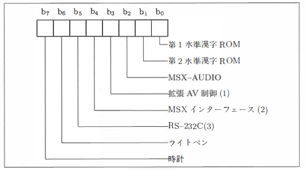

**Figure 2.7: Device Enable**

The **F5H I/O port** controls whether built-in hardware in the MSX system is enabled or disabled. Writing a value to this port activates the hardware corresponding to the bits set to `1`.

**Controlled Hardware:**

- **Bit 0:** Main RAM
- **Bit 1:** Sub-ROM
- **Bit 2:** First-Level Kanji ROM
- **Bit 3:** Second-Level Kanji ROM
- **Bit 4:** MSX-AUDIO
- **Bit 5:** MSX Interface (specified in documentation but not implemented in practice)
- **Bit 6:** RS-232C (not applicable to modems)
- **Bit 7:** Light Pen and Clock

**Notes:**

1. The **Superimpose function**, controlled via the **F7H I/O port**, is included under this system.
2. Features like the MSX Interface are defined in specifications but have not been realized for practical use.
3. RS-232C functionality does not apply to modems.

**Enhanced Compatibility and Reliability in MSX2+**

With the MSX2+, writing a `0` to the **F5H I/O port** disconnects the corresponding built-in hardware from the bus. This update, alongside improvements to the **F4H I/O port**, allows for better compatibility and reliability when creating MSX2+ software. For example, it avoids conflicts when certain programs (e.g., **Write**) attempt to reinitialize the BIOS by jumping to the ROM's **0th address**, a situation that previously caused system confusion.

## 2.3 Slot Configuration in MSX turbo R

This section explains the newly standardized slot configuration of the **MSX turbo R**. The fact that the slot configuration has finally been standardized is a significant milestone in the MSX system's development.

### 2.3.1 Standardized Slot Configuration at Last!

**Figure 2.8** shows the slot configuration of the turbo R. To accommodate the faster CPU and simplify application development and debugging, the slot configuration has been unified.

- **Slot 3-0**: Appears to contain **64 KB of RAM**, but actually connects **256 KB of main RAM** through a memory mapper. The additional RAM beyond 64 KB is typically used for:
  - **Japanese MSX-DOS2 work areas**
  - **RAM disks**
  - **DRAM mode**, explained in another chapter.

Applications can also use this additional RAM by switching the mapper via the extended BIOS.

- **Slot 3-2, Page 1**: Contains the **DOS system ROM**, which includes:
  - **16 KB ROM for MSX-DOS1**
  - **48 KB ROM for MSX-DOS2**
  These ROMs switch automatically as needed.

**Benefits of the Standardized Slot Configuration**

1. **Improved Sub-ROM Inter-Slot Calls**:
   The standardized slot configuration allows DOS programs to perform **sub-ROM inter-slot calls** in a straightforward manner. In previous MSX systems, having RAM and sub-ROMs in expanded slot 0 sometimes caused issues with the inter-slot call functionality of MSX-DOS and could lead to crashes in interrupt handling programs. These problems are eliminated in the turbo R, where RAM and sub-ROMs are located in expanded **slot 3**.

2. **OPLL Driver Placement**:
   The **OPLL driver** (FM-BIOS ROM) is always located in **slot 0-2**. This eliminates the need for turbo R-specific software to search for the slot containing FM-BIOS.

3. **Compatibility with Specialized Cartridges**:
   A notable example of the advantages of standardization is the **Konami 10x Cartridge**. This cartridge required:
   - Slot 1 for the 10x Cartridge.
   - Slot 2 for the game cartridge.
   In some MSX1 and MSX2 models, this setup did not work. However, in the MSX2+ and turbo R, where external slots are fixed to **slot 1** and **slot 2**, such specialized configurations work reliably.

The standardized slot configuration in the turbo R not only improves compatibility but also provides a stable foundation for developing advanced applications and leveraging unique software features.

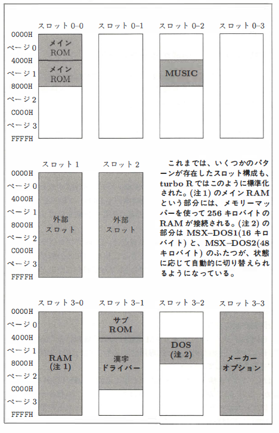

**Figure 2.8: Slot Configuration of the MSX turbo R**

For software developers, the biggest advantage of the standardized slot configuration is the reduction of bugs caused by specific slot configurations. This unification greatly minimizes the challenges they face during development.

From the perspective of software creation, the standardization of the slot configuration is far more beneficial than the faster CPU or increased RAM capacity. 

**Long life to the turbo R!**

# 3. Basic

This chapter is a re-edited version of the "MSX2+ Technical Exploration Team" article published in the April 1989 issue of MSX Magazine.

## 3.1 Analyzing Kanji BASIC
One of the standout features of MSX2+ and later machines, as well as DOS2, is the enhanced usability of kanji (Japanese characters). Kanji can now be used in BASIC program strings and file names. This chapter provides a report on the features of Kanji BASIC.

### 3.1.1 Hardware Required for Kanji BASIC
To use Kanji BASIC, you need either an MSX2+ or turbo R machine, or a DOS2 cartridge. Both include the Kanji BASIC ROM. The difference in functionality is that MSX2+ and turbo R can utilize the natural graphic modes SCREEN 10–12 and have built-in kanji ROM.

Another notable example is Sony's Japanese language cartridge, **HBI-J1**, which includes both Kanji BASIC and kanji ROM, allowing an existing MSX2 machine to support kanji.

Both DOS2 and MSX2+/turbo R also feature "single-kanji conversion." This allows you to specify kanji characters one at a time using their "readings" or "JIS codes." However, for longer text input, "phrase conversion" provided by **MSX-JE** can be added. For example, the phrase "きょうはいいおてんきです" (a string of hiragana) can be converted at once to "今日は良いお天気です" (a kanji-kana mixed sentence).

### Table 3.1: MSX-JE Built-in Hardware
| Manufacturer | Product Name        | Type      | Kanji ROM | SRAM | Notes                          |
|--------------|---------------------|-----------|-----------|------|--------------------------------|
| Panasonic    | FS-A1ST (turbo R)   | Built-in  | 1, 2      | Yes  |                                |
| Panasonic    | FS-A1WSX (MSX2+)    | Built-in  | 1, 2      | Yes  |                                |
| Panasonic    | FS-A1WX (MSX2+)     | Built-in  | 1, 2      | Yes  |                                |
| Panasonic    | FS-SR021            | Cartridge | 1, 2      | Yes  | Word processor cartridge for A1WX |
| Panasonic    | FS-4600F            | MSX2      | 1         | Yes  |                                |
| Sony         | HB-F1XV (MSX2+)     | Built-in  | 1, 2      | Yes  |                                |
| Sony         | HB-F1XDJ (MSX2+)    | Built-in  | 1, 2      | Yes  |                                |
| Sony         | HBI-J1              | Cartridge | 1, 2      | Yes  |                                |
| HAL Labs     | HAL NOTE            | Cartridge | 1, 2      | Yes  | Includes special OS with disk |
| ASCII        | MSX-Write           | Cartridge | 1         | No   |                                |
| ASCII        | MSX-Write J1        | Cartridge | 1, 2      | Yes  |                                |

**Notes:**
- Kanji ROM: Indicates the inclusion of first-level and second-level kanji ROMs.
- SRAM: "Yes" indicates that the device uses non-volatile memory for learning results.

### 3.1.2 Applications Compatible with MSX-JE
MSX-JE is not just a word processor or BASIC extension; it enables phrase conversion functionality across various applications. This shared use of MSX-JE by multiple software programs is economical since kanji ROM and conversion dictionaries are relatively expensive.

Applications marked as **MSX-JE Compatible** adhere to defined specifications, allowing them to work seamlessly with any MSX-JE implementation. However, exceptions exist, such as HAL NOTE, which uses the specialized **HALOS** OS with its combination of cartridges and system disks. These exceptions may not support non-HALOS software.

### 3.1.3 Explaining How the Kanji Driver Works
The internal workings of kanji handling in computers are briefly explained below. While English and katakana characters can be represented with 1-byte codes (8 bits), kanji requires 2-byte encoding. 

**Example JIS Codes:**

- 亜: `3021H` (First Level)
- 腕: `4F53H` (First Level)
- 弐: `5021H` (Second Level)
- 禽: `737EH` (Second Level)

Although convenient, JIS codes can be cumbersome to process when mixed with other character types. To address this, many personal computers, including MSX, use the **Shift JIS** encoding system. This system simplifies handling mixed English and kanji text and is compatible with operating systems like MS-DOS and OS-9, enabling document exchange between different systems.

Characters represented with 2-byte codes (kanji, full-width alphanumeric, etc.) are collectively referred to as **full-width characters**, while 1-byte characters are **half-width characters**. It is important to distinguish between them, as they are treated as entirely separate entities.

**How the Kanji Driver Operates:**

The Kanji Driver handles kanji input/output functions in MSX2+, turbo R, and DOS2. Its operation is illustrated in **Figure 3.1**:
1. Full-width kana or romanized text is input from the keyboard.
2. The input is processed and displayed on the screen.
3. MSX-JE converts the hiragana into kanji (full-width characters).
4. The converted kanji codes are passed to the application program via BASIC or DOS.

This setup ensures that the kanji driver can be utilized not only by BASIC or DOS but also by various application programs.

Conversely, when an application program displays characters on the screen, it simply sends the kanji codes to the Kanji Driver.

For application programs, the Kanji Driver appears as an extension of BASIC commands, BIOS calls, or BDOS calls (BIOS-like functionality in DOS for performing input/output operations) that include kanji input/output features. 

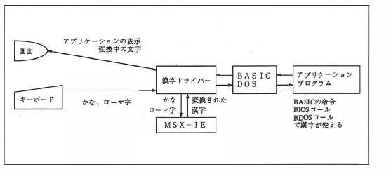
**Figure 3.1: Kanji Driver Operation**

**Application Program**

  - Inputs kana or romaji.
  - Uses BASIC commands, BIOS calls, or BDOS calls for kanji functionality.
  - Displays kanji without directly interacting with the MSX-JE dictionary.

The major advantage of the Kanji Driver is that application programs do not need to handle or manipulate the MSX-JE dictionary themselves. This simplifies development while enabling robust kanji handling capabilities.

### 3.1.4 JE-Compatible Hardware & Software

Below is a summary of MSX-JE-compatible hardware and software released so far:

**Hardware**
- **Modem Cartridges**
  - Panasonic FS-CM1
  - Panasonic FS-CM820
  - Sony HBI-1200
  - Canon VM-300
  - Meisei Electric V-3

- **Modem-Integrated MSX**
  - Panasonic FS-A1FM
  - Sony HB-T7, HB-T600
  - Mitsubishi ML-TS2H

**Software**
- Sony **Bunsho Sakuzaemon**
- Sony **Hagaki Kakizaemon**
- ASCII **MSX-TERM**
- ASCII **MSX-DOS2 TOOLS**
- ASCII **MSXView**

### 3.1.5 Various Screen Modes Usable with Kanji BASIC

MSX2+ and turbo R offer multiple complex screen modes for Kanji BASIC. These modes can be configured with:

- In BASIC: `CALL KANJI` and `WIDTH`
- In DOS2: `KMODE` and `MODE`

For example:

To display a screen with 32 characters × 12 rows, you can use the following commands in **BASIC**:

```basic
CALL KANJI 0
WIDTH 32
```

In **DOS2**, the equivalent commands are:

```text
KMODE 0
MODE 32
```

**Notes on System Language**

If you are using an English version of the system, the Kanji Driver is not loaded by default. You will need to return to BASIC to invoke the Kanji mode.

**Explanation of Table 3.2 Fields**

**Screen Dot Count**

This refers to the number of individual dots displayed on the screen. Kanji characters are represented by combining these dots into patterns.

**Interlaced Display**

For screen modes with 424 vertical dots, the "interlaced" display method is used. This alternates two slightly offset screens to increase the dot density. However, this can cause screen flickering, which may lead to eye strain.

**Kanji Dot Count**

This specifies the number of dots required to display a single Kanji character. Typically, Kanji is displayed using a 16 × 16 dot grid. However, it can be compressed to a 12 × 16 grid to display 40 Kanji characters across a 512-dot-wide screen.

For example:
- Connecting a **Panasonic modem cartridge** automatically selects the built-in **12 × 12 dot Kanji ROM**.

These details ensure optimized display settings for your specific hardware and screen mode requirements.

**Table 3.2: Kanji BASIC Screen Modes**

| **Screen Dot Count** | **Kanji Dot Count** | **Half-width Characters** | **CALL KANJI / WIDTH Setting** |  
|-----------------------|---------------------|----------------------------|--------------------------------|  
| 256 × 192            | 16 × 16            | 32 × 24                   | `CALL KANJI 0 : WIDTH 32`      |  
| 512 × 212            | 12 × 16            | 40 × 26                   | `CALL KANJI 1 : WIDTH 40`      |  
| 256 × 212            | 16 × 16            | 32 × 26                   | `CALL KANJI 0 : WIDTH 32`      |  
| 512 × 424 (Interlaced)| 12 × 16            | 40 × 53                   | `CALL KANJI 1 : WIDTH 40`      |  
| 256 × 424 (Interlaced)| 16 × 16            | 32 × 53                   | `CALL KANJI 0 : WIDTH 32`      |  

**Explanation**

1. **Screen Dot Count**: The resolution of the screen in dots (width × height).  
2. **Kanji Dot Count**: The number of dots used to display a single Kanji character.  
3. **Half-width Characters**: The number of half-width characters (columns × rows) displayed.  
4. **CALL KANJI / WIDTH Setting**: BASIC commands to configure the screen mode.  

For **interlaced modes**, the screen alternates between two slightly offset frames, effectively doubling the vertical resolution but introducing flicker.  

### 3.1.6 Kanji Text and Kanji Graphics

Screen modes in Kanji BASIC introduce a more complex challenge. When executing the following commands in BASIC:

```basic
CALL KANJI 1
WIDTH 40
SCREEN 0
```

The screen switches to the second mode listed in Table 3.2. Interestingly, despite specifying `SCREEN 0`, the VDP (Video Display Processor) operates in a **256 × 212 dot "SCREEN 5"** state. This configuration is referred to as **Kanji Text Mode**.

**Characteristics of Kanji Text Mode**

- **Supported Operations**: 
  - BASIC program input and editing.
  - Data input via `INPUT` statements.
  - Output via `PRINT` statements.
- **Limitations**: 
  - Graphics functions such as `LINE` and `PAINT` are not supported.

**Switching to Kanji Graphics Mode**

To use graphical operations in Kanji mode, you must switch to **Kanji Graphics Mode** using commands like:

```basic
SCREEN 5
```

In this mode:
- **Supported Operations**: 
  - Graphics functions (`LINE`, `PAINT`, etc.) and Kanji output.
- **Limitations**: 
  - Kanji input is generally not supported.

**Important Note**

Ensure you clearly differentiate between **Kanji Text Mode** and **Kanji Graphics Mode**. Mistaking the two can lead to issues in program functionality. A visual representation of these screen mode transitions is summarized in **Figure 3.2**.

### 3.1.7 Proper Usage of the Kanji Driver


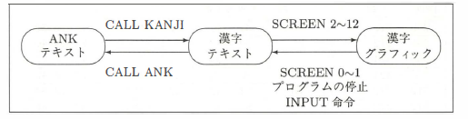
**Figure 3.2: Kanji Driver Operation**

The Kanji Driver overturned the perception that MSX's Kanji features were impractical. However, as it was added to BASIC later, it introduces some unexpected challenges:

1. **Initializing the Kanji Driver**
   - Upon the first execution of `CALL KANJI` after an MSX reset, the Kanji Driver and MSX-JE allocate a work area. This resets BASIC variables and the software stack, potentially causing:
     ```basic
     10 A = 1
     20 CALL KANJIO
     30 PRINT A
     ```
     - First execution outputs `0` (variable `A` reset).
     - Subsequent executions output `1` correctly.

2. **Impact on GOSUB**
   - Example:
     ```basic
     10 GOSUB 80
     70 END
     80 CALL KANJIO
     90 RETURN
     ```
     - This results in the program "forgetting" the return address, causing errors.

3. **Memory Allocation**
   - Allocating memory for the Kanji Driver reduces available BASIC work area. Programs with large memory demands may fail due to insufficient memory.

4. **Kanji Printing Issues**
   - The Kanji Driver converts internal Shift-JIS codes to JIS codes for printing with Kanji-compatible printers. However, this interferes with **bit-image printing** (e.g., graphic printing), requiring disabling the conversion:
     - Write a non-zero value to the `F418H` (RAWPRT) system work area.

**Advanced Programmer Tips**

1. **Kanji Driver Hooks**
   - Table 3.3 lists hooks used by the Kanji Driver. Modifying these can disrupt the driver's functionality:

     | Address | Name      | Function                              |
     |---------|-----------|---------------------------------------|
     | `FDA4H` | `H.CHPU`  | Displays one character on the screen |
     | `FDA9H` | `H.DSPC`  | Displays the cursor                  |
     | `FDAEH` | `H.ERAC`  | Erases the cursor                    |
     | `FDB3H` | `H.DSPF`  | Displays function keys               |
     | `FDB5H` | `H.ERAF`  | Erases function key display          |
     | `FDBDH` | `H.TOTE`  | Switches to text mode                |
     | `FDC2H` | `H.CHGE`  | Reads one character from the keyboard|
     | `FDDBH` | `H.PINL`  | BASIC editor reads one line          |
     | `FDE5H` | `H.INLI`  | Reads one line                       |
     | `FFB6H` | `H.LPTD`  | Writes one character to the printer  |

2. **Register Handling**
   - Kanji-related BIOS calls destroy the shadow registers and `IX`, `IY` registers. Applications relying on these registers may not function correctly in Kanji mode.

By adhering to these guidelines, you can utilize the Kanji Driver effectively while avoiding common pitfalls.

# 4. V9958 VDP

Sections 1 through 4 of this chapter are derived from the "V9938 MSX-VIDEO Technical Data Book" and "V9958 Specifications," re-edited by the editorial team. Common features between **V9938** and **V9958** are omitted, so refer to resources like the "MSX-Datapack" for further details.

Sections 5 through 7 are re-edited versions of articles from **"MSX Magazine"** published in:
- December 1988
- January 1989
- November 1989
- December 1989
- January 1990, under the title "MSX2+ Technical Expedition."

In hardware documentation like the "V9958 Specifications," explanations use the term **"VDP Modes."** However, this book aligns with **MSX Magazine's articles** by using **BASIC screen modes**. The correspondence between VDP modes and BASIC screen modes is shown in **Table 4.1**.

**Table 4.1: Correspondence Between VDP Modes and BASIC Screen Modes**

| **VDP Mode**      | **BASIC Screen Mode**               |
|--------------------|-------------------------------------|
| TEXT 1            | `SCREEN 0 : WIDTH 40`              |
| TEXT 2            | `SCREEN 0 : WIDTH 80`              |
| MULTI COLOR       | `SCREEN 3`                         |
| GRAPHIC 1         | `SCREEN 1`                         |
| GRAPHIC 2         | `SCREEN 2`                         |
| GRAPHIC 3         | `SCREEN 4`                         |
| GRAPHIC 4         | `SCREEN 5`                         |
| GRAPHIC 5         | `SCREEN 6`                         |
| GRAPHIC 6         | `SCREEN 7`                         |
| GRAPHIC 7         | `SCREEN 8 (SCREEN 10–12)`          |

## 4.1 V9958 Register List

**Table 4.2: Mode Registers**
| Register | b7  | b6  | b5  | b4  | b3  | b2  | b1  | b0  | Description                          |
|----------|------|------|------|------|------|------|------|------|--------------------------------------|
| R#0      | 0    | DG   | IE2† | IE1  | MS   | M4   | M3   | 0    | Mode 0                              |
| R#1      | 0    | BL   | IE0  | M1   | M2   | 0    | SI   | MAG  | Mode 1                              |
| R#2      | A13  | A12  | A11  | A10  | A9   | A8   | A7   | A6   | Pattern name T.B.A.                 |
| R#3      | A5   | A4   | A3   | A2   | A1   | A0   | 0    | 0    | Color T.B.A. (Low)                  |
| R#4      | A13  | A12  | A11  | A10  | A9   | A8   | A7   | A6   | Pattern gen. T.B.A.                 |
| R#5      | A5   | A4   | A3   | A2   | A1   | A0   | 0    | 0    | Sprite attr. T.B.A. (Low)           |
| R#6      | TC3  | TC2  | TC1  | TC0  | A15  | A14  | A13  | A12  | Sprite pat. gen. T.B.A.             |
| R#7      | MS†  | LP†  | TP   | CB   | VR*  | SPD  | BW*  | 0    | Text/Back drop color                |
| R#8      | LN   | 0    | SI*  | 0*   | 0    | A15  | A14  | A13  | Mode 2                              |
| R#9      | T23  | T22  | T21  | T20  | A15  | A14  | A13  | A12  | Mode 3                              |
| R#10     | 0    | T3   | T2   | T1   | T0   | 0    | 0    | 0    | Color T.B.A. (High)                 |
| R#11     | 0    | 0    | 0    | A15  | A14  | A13  | A12  | A11  | Sprite attr. T.B.A. (High)          |
| R#12     | 0    | 0    | 0    | 0    | 0    | 0    | 0    | 0    | Text/Back color                     |
| R#13     | T23  | T22  | T21  | T20  | 0    | 0    | 0    | 0    | Blinking period                     |
| R#14     | VRAM | Access address         |    |     |     |     |   |                                    |
| R#15     | Status register pointer       |    |     |     |     |   |   |                                    |
| R#16     | Color palette address         |    |     |     |     |   |   |                                    |
| R#17     | Control reg. pointer          |    |     |     |     |   |   |                                    |
| R#18     | Display adjust                |    |     |     |     |   |   |                                    |
| R#19     | Display offset                |    |     |     |     |   |   |                                    |
| R#20*    | Color burst 1                 |    |     |     |     |   |   |                                    |
| R#21*    | Color burst 2                 |    |     |     |     |   |   |                                    |
| R#22*    | Color burst 3                 |    |     |     |     |   |   |                                    |
| R#23     | Interrupt line                |    |     |     |     |   |   |                                    |
| R#25†    | Horizontal scroll (High)      |    |     |     |     |   |   |                                    |
| R#26†    | Horizontal scroll (Low)       |    |     |     |     |   |   |                                    |
| R#27†    |                               |    |     |     |     |   |   |                                    |


**Notes:**

- Bits labeled as "0" must always be written with a value of `0`.
- **Editorial Note:** Bits reserved for hardware control must not be modified by standard application programs.
- Flags present in **V9938** but absent in **V9958** must always be set to `0` when using **V9958**.
- Registers marked with `t` are newly added in **V9958**. These registers are initialized with a value of `0` to ensure compatibility with the functionality of **V9938**.
- Register **24** is intentionally omitted (missing register).


**Table 4.3: Command Registers**

| Register | b7 | b6 | b5 | b4 | b3 | b2 | b1 | b0 | Description                |
|----------|----|----|----|----|----|----|----|----|----------------------------|
| R#32     | SX7 | SX6 | SX5 | SX4 | SX3 | SX2 | SX1 | SX0 | Source X (Low)         |
| R#33     |  0  |  0  |  0  |  0  | SX10| SX9 | SX8 | SX7 | Source X (High)        |
| R#34     | SY7 | SY6 | SY5 | SY4 | SY3 | SY2 | SY1 | SY0 | Source Y (Low)         |
| R#35     |  0  |  0  |  0  |  0  | SY10| SY9 | SY8 | SY7 | Source Y (High)        |
| R#36     | DX7 | DX6 | DX5 | DX4 | DX3 | DX2 | DX1 | DX0 | Destination X (Low)    |
| R#37     |  0  |  0  |  0  |  0  | DX10| DX9 | DX8 | DX7 | Destination X (High)   |
| R#38     | DY7 | DY6 | DY5 | DY4 | DY3 | DY2 | DY1 | DY0 | Destination Y (Low)    |
| R#39     |  0  |  0  |  0  |  0  | DY10| DY9 | DY8 | DY7 | Destination Y (High)   |
| R#40     | NX7 | NX6 | NX5 | NX4 | NX3 | NX2 | NX1 | NX0 | Number of dot X (Low)  |
| R#41     |  0  |  0  |  0  |  0  | NX10| NX9 | NX8 | NX7 | Number of dot X (High) |
| R#42     | NY7 | NY6 | NY5 | NY4 | NY3 | NY2 | NY1 | NY0 | Number of dot Y (Low)  |
| R#43     |  0  |  0  |  0  |  0  | NY10| NY9 | NY8 | NY7 | Number of dot Y (High) |
| R#44     | CH3 | CH2 | CH1 | CH0 | CL3 | CL2 | CL1 | CL0 | Color                  |
| R#45     | CM3 | CM2 | CM1 | CM0 | L03 | L02 | L01 | L00 | Argument               |
| R#46     | CM3 | CM2 | CM1 | CM0 | L03 | L02 | L01 | L00 | Command                |


**Table 4.4: Status Registers**

| Register | b7   | b6   | b5   | b4   | b3   | b2   | b1   | b0   | Description         |
|----------|-------|-------|-------|-------|-------|-------|-------|-------|---------------------|
| S#0      | F     | 5SF   | C     | 5S4   | 5S3   | 5S2   | 5S1   | 5S0   | Status 0           |
| S#1      | FL↑   | LPST↑| ID4   | ID3   | ID2   | ID1   | ID0   | FH    | Status 1           |
| S#2      | TR    | VR    | HR    | BD    | 1     | 1     | EO    | CE    | Status 2           |
| S#3      | X7    | X6    | X5    | X4    | X3    | X2    | X1    | X0    | Column (Low)       |
| S#4      | 1     | 1     | 1     | 1     | X10   | X9    | X8    | X7    | Column (High)      |
| S#5      | Y7    | Y6    | Y5    | Y4    | Y3    | Y2    | Y1    | Y0    | Row (Low)          |
| S#6      | 1     | 1     | 1     | 1     | Y10   | Y9    | Y8    | Y7    | Row (High)         |
| S#7      | C7    | C6    | C5    | C4    | C3    | C2    | C1    | C0    | Color              |
| S#8      | BX7   | BX6   | BX5   | BX4   | BX3   | BX2   | BX1   | BX0   | Border X (Low)     |
| S#9      | 1     | 1     | 1     | 1     | BX10  | BX9   | BX8   | BX7   | Border X (High)    |

† The bits in the table marked as existing in V9938 but not in V9958 have no meaning in V9958, and their values should be ignored.
V9958's ID is `00010B`.

## 4.2 New Features of V9958

### 4.2.1 Horizontal Scrolling

| Register | b7   | b6   | b5   | b4   | b3   | b2   | b1   | b0   |
|----------|-------|-------|-------|-------|-------|-------|-------|-------|
| R#25     | CMD  | VDS   | YAE   | YJK   | WTE   | MSK   | SP2   |       |
| R#26     | HO7  | HO6   | HO5   | HO4   | HO3   | HO2   | HO1   | HO0   |
| R#27     | -     | -     | -     | -     | HO2   | HO1   | HO0   |       |

- **HO0 to HO7**: These define the horizontal scroll amount.  
  - For **SCREEN 6 and 7**, the scroll amount is in units of **2 dots**.  
  - For other screen modes, the scroll amount is in units of **1 dot**.

- **SP2 (Scroll Page 2)**:
  - `SP2 = 0` (default): The horizontal screen size is set to **1 page**.
  - `SP2 = 1`: The horizontal screen size is set to **2 pages**.

- **MSK (Mask)**:
  - `MSK = 0` (default): The left edge of the screen is **not masked**.
  - `MSK = 1`:  
    - For **SCREEN 6 and 7**, the left 16 dots of the screen are masked.  
    - For other screen modes, the left 8 dots of the screen are masked.  
    - In both cases, the border color is displayed.

- **HO0 to HO3**: Adjust the display screen to shift leftward by the set value.  
  - The shift is in units of **8 dots** for standard screens.  
  - For **SCREEN 6 and 7**, the shift is in units of **16 dots**.

- **SP2 = 0**:  
  Only one screen's worth of data is displayed with horizontal scrolling.  
  `HO5` is ignored.

- **SP2 = 1**:  
  Two screens' worth of data are displayed with horizontal scrolling.  
  The `A15` bit of the pattern name table's base address must be set to 1.  
  - Base addresses for the pattern name table:  
    - `0–31`: Use the configured value with `A15=0`.  
    - `32–63`: Use the configured value with `A15=1`.  
  - Base addresses for the pattern generator table and color table remain unchanged regardless of scrolling.

- **HO0 to HO3**:  
  Adjust the display screen to shift **rightward** by the configured value.  
  - Shift is in units of **1 dot** for most screens.  
  - For **SCREEN 6 and 7**, the shift is in units of **2 dots**

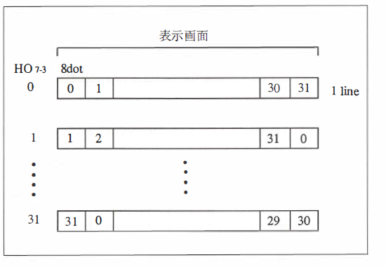
**Figure 4.1: Horizontal Scrolling**

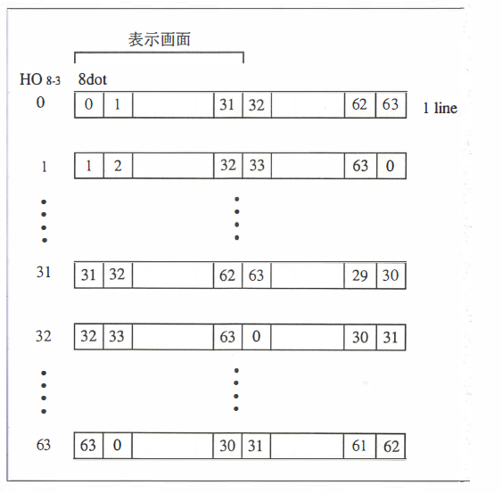
**Figure 4.2: Horizontal Scrolling in SCREEN 6 and 7**

### 4.2.2 Wait Functionality

| Register | b7  | b6  | b5  | b4  | b3  | b2  | b1  | b0  |
|----------|------|------|------|------|------|------|------|------|
| R#25     | 0    | CMD  | VDS  | YAE  | YJK  | WTE  | MSK  | SP2  |

- **WTE = 0** (default):  
  The wait function is **disabled**.

- **WTE = 1**:  
  The wait function is **enabled**.  
  When the CPU accesses VRAM, all accesses to V9958 ports are delayed until the VRAM access is complete.  
  Note: The wait function does not apply to register or color palette access, nor to command data readiness.

### 4.2.3 Commands

| Register | b7  | b6  | b5  | b4  | b3  | b2  | b1  | b0  |
|----------|------|------|------|------|------|------|------|------|
| R#25     | 0    | CMD  | VDS  | YAE  | YJK  | WTE  | MSK  | SP2  |

- **CMD = 0** (default):  
  The command function is enabled **only for SCREEN 5–12**.

- **CMD = 1**:  
  The command function is enabled for **all screen modes**.  
  For screen modes other than SCREEN 5–12, it operates as **SCREEN 8**.  
  Parameters must be configured using SCREEN 8's **X-Y coordinate system**.


### 4.2.4 YJK Format Display

| Register | b7  | b6  | b5  | b4  | b3  | b2  | b1  | b0  |
|----------|------|------|------|------|------|------|------|------|
| R#25     | 0    | CMD  | VDS  | YAE  | YJK  | WTE  | MSK  | SP2  |

- **YJK = 0** (default):  
  Data in VRAM is treated as **RGB format** (3, 3, 2 bits each).  
  Sprite colors remain unchanged.

- **YJK = 1**:  
  Data in VRAM is treated as **YJK format** and converted into **RGB signals** (5 bits each).  
  - Analog output is provided via the RGB terminal.  
  - Sprite colors use the palette.

**YAE Settings**

- **YAE = 0**:  
  No attribute is present. Data format groups 4 dots together.

| Bits | Description    |
|------|----------------|
| C7-C0 | Color data     |
| YKL  | Low Y value    |
| YKH  | High Y value   |
| J    | J component    |
| K    | K component    |

- **YAE = 1**:  
  Each dot has its own attribute. Data format groups 4 dots together.

| Bits | Description    |
|------|----------------|
| C7-C0 | Color data     |
| YKL  | Low Y value    |
| YKH  | High Y value   |
| J    | J component    |
| K    | K component    |

**YJK and RGB Conversion Formula (Reference)**

**Conversion Formulas**

- **From YJK to RGB**:
  - `R = Y + J`
  - `G = Y - (J + K) / 2`
  - `B = Y + K`

- **From RGB to YJK**:
  - `Y = (R + G + B) / 3`
  - `J = R - Y`
  - `K = B - Y`

**Note**:  
- Y values are integers ranging from **0 to 31** (no attributes) or **0 to 30 (even)** (with attributes).  
- J and K values are integers ranging from **-32 to 31**.  
- Conversion results are clipped to the range **0–31**.


## 4.3 V9958 Deprecated Features

The following features, present in V9938, were removed in V9958:
- **Composite Video Output**
- **Mouse/Light Pen Interface**  
  *(Editor's Note): The MSX mouse does not utilize the V9938's mouse interface functionality, so the removal of this feature has no impact.*

## 4.4 V9958 Hardware Specifications (Changes)

**Changes in Terminal Configuration**

**Table 4.5: Changes in V9958 Terminals**

| Pin | V9958 Function            | Description                                      | Pin | V9938 Function         |
|-----|---------------------------|--------------------------------------------------|-----|-------------------------|
| 4   | VRESET                   | Separated input for 3-value logic of HSYNC/CSYNC | 4   | HSYNC/CSYNC (3-value)  |
| 5   | HSYNC                    | HSYNC output or n flag output                    | 5   | HSYNC I/O              |
| 6   | CSYNC                    | CSYNC I/O                                        | 6   | CSYNC I/O              |
| 8   | CPUCLK / VDS             | CPU clock output or VDS output                   | 8   | CPUCLK                 |
| 21  | AVDD (DAC)               | Analog power supply                              | 21  | VIDEO                  |
| 26  | WAIT                     | WAIT I/O                                         | 26  | LPS                    |
| 27  | HRESET                   | Separated input for 3-value logic of HSYNC/CSYNC | 27  | LPD                    |

- **R#25 Bit 5 (`VDS`)**:  
  - If **VDS flag = 0**, pin 8 functions as **CPUCLK output**.  
  - If **VDS flag = 1**, pin 8 functions as **VDS output**.

**Electrical Characteristics of V9958**

**Table 4.6: V9958 DC Characteristics**

| Symbol | Parameter                 | Minimum | Typical | Maximum | Unit     |
|--------|---------------------------|---------|---------|---------|----------|
| `VIL`  | Low-Level Input Voltage   |         | 0.3     |         | V        |
| `VIH`  | High-Level Input Voltage  | 2.2     |         |         | V        |

**HSYNC, CSYNC, CPUCLK/VDS, WAIT**

| Symbol | Parameter                 | Test Conditions           | Minimum | Typical | Maximum | Unit |
|--------|---------------------------|---------------------------|---------|---------|---------|------|
| `VOL`  | Low-Level Output Voltage  | `IOL = 1.6mA`            |         |         | 0.4     | V    |
| `VOH`  | High-Level Output Voltage | `IOH = 0.1mA`            | 2.4     |         |         | V    |

**G, R, B Signals**

| Symbol   | Parameter                     | Test Conditions          | Minimum | Typical | Maximum | Unit |
|----------|-------------------------------|--------------------------|---------|---------|---------|------|
| `VRGB31` | Maximum Output Voltage        | `RL = 470Ω`             | 2.8     |         |         | V    |
| `VRGB0`  | Minimum Output Voltage        | `RL = 470Ω`             |         | 2.0     |         | V    |
| `VP-P`   | Voltage Swing (`VRGB31 - VRGB0`) | `RL = 470Ω`             | 0.8     |         |         | V    |
| `ΔRGB`   | Output Deviation              | `RL = 470Ω`             |         | 5       |         | %    |

## 4.5 V9958 and MSX2+

The component responsible for controlling the display in MSX computers is called the "Video Display Processor" (VDP). While MSX2 used the "V9938" VDP, MSX2+ and later models upgraded to the "V9958" with additional features. This section introduces the features added in V9958.

### 4.5.1 Screen Modes: A Total of 12 Types

**Screen Modes**: These refer to the display configurations that can be changed using the `SCREEN` command in BASIC. For example:
- To set the screen to a text mode for writing BASIC programs with 40 columns:
  ```
  SCREEN 0 : WIDTH 40
  ```
- To draw graphics:
  ```
  SCREEN 8
  ```

Although having many screen modes may seem complex, MSX2+ provides these options for valid reasons.

**Table 4.7: MSX2+ Screen Modes**

| Mode | Display Type       | Resolution        | Colors                  | Description                                                                                   |
|------|--------------------|-------------------|-------------------------|-----------------------------------------------------------------------------------------------|
| 0    | Text (1)           | 80 × 24 characters | Foreground and background colors can be specified.                                           |
| 1    | Text (2)           | 32 × 24 characters | Foreground and background colors can be specified.                                           |
| 2    | Pattern Table (3)  | 256 × 192 dots    | 16 colors. Two colors can be specified per 8 horizontal dots.                                |
| 3    | Bitmap (4)         | 64 × 48 dots      | 16 colors.                                                                                    |
| 4    | Pattern Table      | 256 × 192 dots    | 16 colors. Two colors can be specified per 8 horizontal dots.                                |
| 5    | Bitmap             | 256 × 212 dots    | 16 colors.                                                                                    |
| 6    | Bitmap             | 512 × 212 dots    | 4 colors.                                                                                     |
| 7    | Bitmap             | 512 × 212 dots    | 16 colors.                                                                                    |
| 8    | Bitmap             | 256 × 212 dots    | 256 colors.                                                                                   |
| 9    | Blank (5)          | N/A               | Not available in Japanese MSX computers.                                                     |
| 10   | YJK + RGB          | 256 × 212 dots    | 12,499 colors (refer to text for details).                                                   |
| 11   | YJK + RGB          | 256 × 212 dots    | 12,499 colors (refer to text for details).                                                   |
| 12   | YJK                | 256 × 212 dots    | 19,268 colors (refer to text for details).                                                   |

**Notes**:
1. **Text Mode (1)**: Characters are represented as 6×8 dots, displaying English letters and katakana.  
2. **Text Mode (2)**: Characters are represented as 8×8 dots, displaying English letters, katakana, and hiragana.  
3. **Pattern Table**: The screen is created by combining 8×8 dot patterns.  
4. **Bitmap Mode**: Colors can be displayed without being affected by adjacent colors.

**Reasons for Multiple Screen Modes:**

1. **Speed**: Displaying text in graphics modes can be slow. Text modes are faster and more practical for tasks like programming.
2. **Memory Usage**: High-resolution and color-rich modes require significantly more memory. For example, a SCREEN 8 display requires 54,272 bytes of memory, limiting how much can fit on a single 2DD disk.
3. **Compatibility**: As MSX evolved, new modes were added to maintain backward compatibility while supporting advanced features.  
   - MSX introduced SCREEN 0 to 3 (4 modes).  
   - MSX2 added SCREEN 4 to 8 for high-resolution graphics.  
   - MSX2+ added SCREEN 10 to 12 to increase color depth.

This variety ensures the flexibility and compatibility of MSX systems.

**Additional Features**

- **Interlaced Mode**: Doubles vertical resolution but may cause screen flickering.  
- **Kanji Mode**: Newly introduced in MSX2+ for better handling of Japanese characters.

### 4.5.2 Controlling VDP Registers

The Video Display Processor (VDP) in MSX computers features "registers," similar to the CPU, for controlling screen output. These registers can be manipulated by the CPU via I/O ports. The VDP registers are categorized into:

1. **Control Registers**: Used by the CPU to control the VDP.
2. **Status Registers**: Used by the CPU to monitor the VDP's status.
3. **Command Registers**: These enable the execution of advanced VDP commands but are not covered in this guide as they are not utilized in the provided programs.

**VDP I/O Ports**

The VDP is accessed through I/O ports, typically ranging from 98H to 9BH. However, the exact port addresses depend on the contents of ROM addresses 6 and 7, as shown in **Table 4.8**.

**Table 4.8: VDP I/O Ports**

| Port Name      | R/W  | I/O Address                 | Function                        |
|----------------|-------|-----------------------------|----------------------------------|
| Port 0 (Read)  | Read  | ROM address 6 content       | VRAM Read                       |
| Port 1 (Read)  | Read  | ROM address 6 content + 1   | Status Register                 |
| Port 0 (Write) | Write | ROM address 7 content       | VRAM Write                      |
| Port 1 (Write) | Write | ROM address 7 content + 1   | Control Register                |
| Port 2 (Write) | Write | ROM address 7 content + 2   | Palette Register                |
| Port 3 (Write) | Write | ROM address 7 content + 3   | Indirect Registers              |

**Setting Control Registers**

1. **Writing Values**:
   - To set a value, first write the data to **Port 1**.
   - Then write the register number plus 128 to the same port.
   - This must be done consecutively to avoid VDP confusion if an interrupt occurs between the two writes. Use the `DI` command to disable interrupts before writing.

2. **Reading Specific Bits**:
   - Control registers are write-only, so their values cannot be read back directly.
   - To change specific bits, store the register values in a system work area (RAM). Modify the value in RAM, then write the updated value to both the register and the RAM location.

**Example Work Area:**
- RAM location F3E0H stores the value for Control Register 1. Modify the value in RAM, then write the new value to Control Register 1.

**Reading Status Registers**

To read status register values:
1. Write the status register number to Control Register 15.
2. Read the value from **Port 1**.
3. Reset Control Register 15 to 0.
4. Perform this entire process with interrupts disabled.

**Table 4.9: Control Register Save Locations**

| Register No. | Function     | Save Address | Label    |
|--------------|--------------|--------------|----------|
| 0            | RG0 Function | F3DFH        | RG0SAV   |
| 7            | RG7 Function | F3E6H        | RG7SAV   |
| 8            | RG8 Function | FFE7H        | RG8SAV   |
| 23           | RG23 Function| FFF6H        | RG23SA   |
| 25           | RG25 Function| FFFAH        | RG25SA   |
| 26           | RG26 Function| FFFBH        | RG26SA   |
| 27           | RG27 Function| FFFCH        | RG27SA   |

**Additional System Work Areas**

**Table 4.10: General System Work Areas**

| Address | Label      | Description                                   |
|---------|------------|-----------------------------------------------|
| F341H   | RAMAD0     | Slot number for Page 0 RAM                   |
| F342H   | RAMAD1     | Slot number for Page 1 RAM                   |
| F343H   | RAMAD2     | Slot number for Page 2 RAM                   |
| F344H   | RAMAD3     | Slot number for Page 3 RAM                   |
| FAF5H   | DPPAGE     | Display page number                          |
| FAF6H   | ACPAGE     | Active page number                           |
| FD9AH   | H.KEYI     | Interrupt hook                               |
| FD9FH   | H.TIMI     | Timer interrupt hook                         |

**Table 4.11: MSX2+ System Work Areas**

| Address  | Label     | Description                                      |
|----------|-----------|--------------------------------------------------|
| OFAFCH   | MODE      | Various mode settings (see Table 4.12).          |
| OFAFDH   | NORUSE    | Kanji Driver Work Area                           |
| OFDOAH   | SLTWRK+1  | Kanji Driver Work Area                           |
| OFDOFH   | SLTWRK+6  | Kanji Driver Work Area                           |
| OFFFAH   | RG25SA    | VDP Register Save                                |
| OFFFBH   | RG26SA    | VDP Register Save                                |
| OFFFCH   | RG27SA    | VDP Register Save                                |

**Table 4.12: Details of OFAFCH (MODE)**

| Bit | Description                                               |
|-----|-----------------------------------------------------------|
| b7  | 1: Katakana, 0: Hiragana                                 |
| b6  | 1: Second-level Kanji ROM exists                         |
| b5  | 1: SCREEN 11, 0: SCREEN 10                               |
| b4  | Used internally                                          |
| b3  | 1: SCREEN 0–3 VRAM address mask at 3FFFH                |
| b2  | VRAM capacity (00: 16KB, 01: 64KB, 10: 128KB)            |
| b0  | 1: Enable Roman character-to-Kana conversion            |

**Note**: While the ROM BIOS provides equivalent subroutines for most of these operations, they may be slower as they involve calling the sub-ROM. Custom routines may be used for time-sensitive processes like scanline interrupts.
